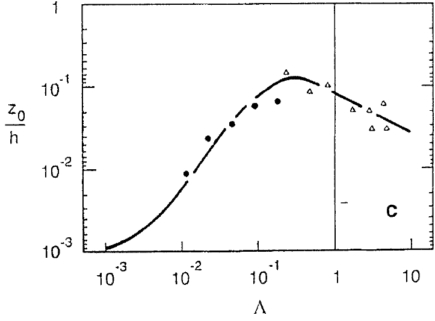

```{r setup, include = FALSE}
knitr::opts_chunk$set(
  collapse = TRUE,
  comment = "#>"
)
```
#The ForestGALES win risk model and the *fgr* R package
For a thorough scientific description of the model, please refer to Hale et al. (2015) and Hale et al. (2012). The material presented in these vignettes is meant to provide the reader with: a general introduction to the field of forest wind damage risk modelling; the use, limitations, and development of the *fgr* package. Additionally, some clarifications are presented of the approach used in ForestGALES to deal with complex issues such as: the maximum bending moment on forest trees caused by wind gusts; the combined effects of upwind gaps, distance of a tree from the upwind edge, and spacing on the bending moment; and the effect of stem, canopy, and snow weight when applicable on the total bending moment experienced by trees in the wind.

ForestGALES (Hale et al., 2015) is a mostly mechanistic, process-based mathematical model to calculate the risk of wind damage to forested stands.
It was originally developed for predicting wind damage in the interior of unthinned or lightly thinned commercial conifer stands in Great Britain (Gardiner et al., 2000).

The model has since found favour in the scientific community and in forest management applications. It has been been parameterised for the most common British conifer species (Gardiner et al., 2008), as well as for some conifer species in Canada, Denmark, France, Japan, and New Zealand (Byrne, 2005; Cucchi et al., 2005; Kamimura et al., 2008; Mikkelsen, 2007; Moore and Somerville, 1998; Ruel et al., 2000), and recently for *Eucalyptus globulus* in Spain (Locatelli et al., 2016). Model parametrisation for other broadleaf species included in this package (i.e. Oak, Birch, and Beech) is still at the developmental stage and as such should be used with some caution.

Throughout the package documentation, we will use the name *ForestGALES* to refer to the model characteristics as described in e.g. Hale et al. (2015) or Gardiner et al. (2000, 2008). Conversely, when we refer to the functionalities implemented in this package, we use the name *fgr*.

## Wind damage to trees and forest stands
The mechanical forces acting on a tree during a windstorm are exerted by the wind itself and by gravity. Momentum transfer from the wind to a tree is applied by way of canopy resistance to the wind (Mayhead et al., 1975) and produces bending stresses in the stem (Milne, 1995) and in the roots (Coutts, 1986). The force of the wind ($F_{Wind}$, N) acting at any height z up a tree is calculated in Eq.1 (Peltola, 2006):
\begin{align}
F_{Wind} = \frac{1}{2} \cdot C_d \cdot \rho \cdot u(z)^2 \cdot A(z)
\end{align}
Where $C_d$ is the drag coefficient of the tree canopy (dimensionless), $\rho$ is the air density (kg m-3), $u(z)$ is the mean wind speed (m s-1) at height z, and A(z) is the streamlined projected area (m2) of the canopy and stem of the tree at height z. As a tree is swayed from its vertical axis under the action of the wind, an additional force ($F_{Tree}$, N) is provided by the gravitational force acting on the masses of the stem, canopy, and snow, when applicable (Peltola, 2006). This gravitational force can similarly be calculated at any height z (Eq.2):
\begin{align}
F_{Tree}(z) = M(z) \cdot g
\end{align}
Where M(z) is the mass (kg) of the tree components, and snow when applicable, and g is the gravitational constant (m s-2). Using Eq. 1 and 2 it is possible to calculate the total bending moment resulting from wind and gravitational forces, at any point along the stem (Eq.3):
\begin{align}
BM_{max}(z) = F_{Wind} \cdot z + F_{Tree} \cdot x(z)
\end{align}
Where z is the height along the tree (m) and x(z) is the horizontal displacement (m) of the tree under the wind loading. The horizontal displacement is assumed proportional and inversely proportional, respectively, to the force of the wind and the stiffness of the stem (Peltola and Kellomaki, 1993). The stiffness of the stem is defined as the product of the Modulus of Elasticity of stem wood by the second moment of area of the cross section of the stem (i.e. EI), calculated from the stem diameter (Wood, 1995). The stem and the root-soil plate provide resistance to breakage and overturning, respectively. These resistive moments are the result of stem stiffness, wood strength, weight of the root-soil plate, structural strength of the roots, and the soil shear strength. Figure 1, from Peltola (2006), provides a diagrammatical representation of these forces.


Tree resistance to breakage is based on the assumption that stress from wind loading in the outer fibres of the stem is constant along the height of the stem between the base of the canopy and the base of the tree (Morgan and Cannell, 1994). Following this, calculation of the stress can be performed at any height up the stem (e.g. at tree base, or at breast height, 1.3m). When the calculated stress exceeds the Modulus of Rupture of green wood, it is predicted that the tree stem will break (Peltola, 2006). It is known that the presence of wood knots can decrease stem strength (e.g. Lavers, 1969).

Tree anchorage can be impaired when trees are shallow-rooted, as in poorly drained soils which are not favourable to the development of sinker roots or taproots, which can provide the tree with additional anchorage (Peltola, 2006). This often happens when a hardpan layer is present in the soil at shallow depths, raising the water table (Danjon, 2005). Under such circumstances, and in the absence of further constraints, trees devote their resources on the radial and lateral development of roots to improve anchorage (Nicoll et al., 2006; Ray and Nicoll, 1998). Coutts (1986) reports that when mechanically uprooting shallow-rooted Sitka spruce trees (*Picea sitchensis* (Bong) Carr.) under static forces, the root system component that provided most of the anchorage at maximum load was the windward roots. At high latitudes, ground frost can improve tree stability during winter months (Peltola et al., 1999). 

## Introducing the *roughness* and the *TMC* methods
ForestGALES' calculations of stand vulnerability to wind damage, and the associated risk, are derived from tree dimensions and stand and site characteristics. 
By vulnerability, we mean the critical wind speeds (CWS) of damage. These are the wind speeds that would generate a critical turning moment on the tree that would result in tree damage, either in the form of stem breakage or tree uprooting. 

Within ForestGALES, two methods have been developed for these calculations (Hale et al., 2015). The original '*roughness*' method is designed to calculate the vulnerability of, and risk to a homogeneous forest stand. The 'turning moment coefficient' (*TMC*) method instead allows calculating the vulnerability of, and risk to individual trees within a stand. The *TMC* method therefore lends itself very well to the wind damage risk assessment of heterogeneous forest stands.

Regardless of the method employed, ForestGALES can be conceptually divided in 2 modules. The main one - GALES - calculates the CWS that are expected to result in wind damage by uprooting or stem breakage. The differences between the *roughness* and *TMC* methods are specific to the GALES module. The second  module calculates the probability of exceeding such wind speeds (Gardiner et al., 2008). The probability of exceeding the calculated CWS is derived from information on the wind climate of the area of interest. Typically, the shape and scale (A and k, respectively) parameters of a Weibull distribution of mean wind speed are used to describe the prevailing wind climate in a given location (Quine, 2000). The Weibull parameters can either be fitted to time series of local wind speed data, or calculated from an airflow model (e.g. WAsP, https://www.wasp.dk/ ). In Great Britain, the localised wind climate is typically described with DAMS scores (Detailed Aspects Method of Scoring). These describe the windiness of a site based on topographic characteristics, and are only available for Britain (Quine and White, 1994).
ForestGALES operates with Weibull parameters. For forests in the UK, when Weibull parameters are not available, ForestGALES uses a standard value of Weibull k (1.85, the default in the *fgr* package) and translates DAMS scores into Weibull A (Quine, 2000).

The *roughness* version of the model is based on the idea of momentum stress partitioning (Raupach, 1994) between trees to calculate the wind loading on the mean tree in the forest, and a Gust factor to convert from mean to extreme wind loading. Locatelli et al. (2017) submitted the *roughness* method to a Global Sensitivity Analysis (performed with a Copula extension of the method of Sobol' to allow covariance between variables, as expected for e.g. tree height and dbh) to identify the main drivers of variation in the model outputs. Their results show that, for the GALES module, tree height and dbh are the main drivers of variance, followed by spacing and gap size. The effect of species is marginal compared to these, as is that of soil type and rooting depth. With regards to the probabilities of damage, the wind climate is the most important variable.

The new *TMC* approach to calculating the CWS is based instead on direct linear relationships between tree size, the maximum turning moment, and the mean wind speed at canopy top, thus removing the need for a Gust factor. It can simulate the effect of stand thinnings on the wind loading on the retained trees, and allows the use of competition indices to model tree interactions. In the *fgr* R package, two competition indices identified by Hale et al. (2012) are available to the user. One is independent of the distance between trees, and rather based on the basal area of trees larger than the target tree (*bal* in the package). The other (*heg* in the package) is a distance-dependent index developed by Hegyi (1974).
The *TMC* approach is designed for mixed species stands, and for structurally complex stands with multiple stories. It is still at the developmental stage, and it borrows some procedures from the *roughness* method, most notably the conversion of the calculated critical wind speeds at canopy top to the corresponding critical wind speeds at a height compatible with anemometer standards, required for the estimation of the probabilities of damage. For the calculations of the aerodynamic parameters (zero-plane displacement and canopy surface roughness) required in the `elevate` function, and for the gap and edge effects calculations, we have introduced the concept of *equivalent mean height*. This requirement is dictated by the fact that for *stand-level* calculations in structurally complex stands, all storeys need to be accounted for. However, using the arithmetic mean of the height of all trees in a multi-storey stand might put too much emphasis on small trees, which are less affected by wind stress because of the wind speed profile within the canopy (Gardiner, 2008). For now, we overcome this problem with the use of *equivalent mean height*, calculated from stand top height, and which essentially is akin to a weighed mean favouring tall trees. The rationale for this is that, at stand level, the bulk of wind-induced moment absortion from the canopy is performed by taller-than-average trees within a multi-storey stand.      

## *fgr* R Vignette documentation
This vignette documentation for the *fgr* R package is structured around the various components of the *roughness* and *TMC* methods. Example datasets are available for both methods.

At the topmost level, the inputs and outputs are summarised in the `Wrapper Functions` section. The model is designed to encourage users to customise their simulations with as much information as it is available. At the same time, the model is equipped with default values and formulas, some of which are species-specific, to allow more conventional wind damage risk simulations. 
Essential, Desirable, and Advanced inputs are introduced in the `Wrapper Functions` section of this vignette. Essential inputs differ between the *roughness* and the *TMC* method, but typically include: tree species, tree height, dbh, and spacing. Without these, the CWS cannot be computed. Default values for Desirables, often species-specific, are provided in case these inputs are not known by the user. This corresponds to the most common use of ForestGALES for use in forest management against wind damage. The Advanced inputs allow extensive customisation in case specific values (e.g. of the mechanical properties of green wood) are known. Finally, if information on the localised wind climate is known, the calculated CWS can be translated into the probabilities of damage. Otherwise, the simulations return the CWS only.
With regards to the model outputs, users can choose between a short list of essential outputs (CWS and associated probabilities), or an extensive list of model outputs which include e.g. the critical moments, and the aerodynamic and streamlining properties of the stand. 

Functions to calculate the volume of tree stem and canopy are provided in the package, and documented in the `Stem Volume` section of this vignette. These functions are to an extent species-specific and based on published tree taper functions. Stem and canopy volume are part of the Advanced inputs and as such they can be customised if required. 

Similarly, the conversion between top and mean height, the calculation of essential mean height for the *TMC* method, and the calculation of canopy dimensions (length and width) are performed with species-specific parameters, as described in the `Tree Dimensions` section. The resulting tree dimensions can be overridden by the user as they are either Essential or Desirable inputs.

The various components of the *roughness* and *TMC* methods are described in the remaining documentation. The calculations of the critical moments of stem breakage and tree overturning are described in the `Critical Resistive Moments` section. The data sources for the combination of soil type/rooting depth, and species-specific values of tree anchorage are reported in this section. Similarly, the soil classification used in ForestGALES is presented there.

The `Streamlining and Drag` section documents the approach used to model the aerodynamic and streamlining properties of the modelled stand, as calculated with *fgr* from the work of Thom (1971), Mayhead et al. (1975), and Raupach (1992, 1994). The drag over the canopy is discussed, with the description of the calculation of $u_*$ (the friction velocity), $z_0$ (canopy roughness), $d$ (the zero-plane displacement) and $\gamma$ (i.e. the frontal area - per unit ground area - of the trees as roughness elements). The streamlining of the crown is also discussed.

The different approaches to calculating the citical moments in the *roughness* and the *TMC* methods are described separately. In the `Bending Moment Roughness` section, the theory of wind shear stress partitioning on the trees canopy is introduced, along with the effect of the Gust factor. Both the original formulas, published in the literature (e.g. Gardiner et al., 2000; Hale et al., 2015), and the modifications adopted in the *fgr* R package to improve model performance, are discussed.

The approach developed by Hale et al. (2012) to calculate the CWS of individual trees wihthin a stand is introduced in the `Turning coefficients functions` section. The relationship (termed $T_C$, the turning moment coefficient) between the Maximum applied turning moment at tree base and the mean wind speed at the top of the canopy is discussed, as is the relationship between $T_C$ and tree size. The use of the *bal* and the *heg* competition indices in the calculations of $T_C$ is discussed, as is the modelling of thinnings using the *TMC_Ratio* of tree spacing before and after thinning.

In the current release of *fgr*, the additional moment provided by the weight of the stem, canopy, and snow (when present) is accounted for with the *Deflection Loading Factor* (DLF), which has been derived from the work of Gardiner (1989, 1992). The `Deflection Loading Factor` section introduces the concepts used for the calculation of DLF.

The `Edge Gap and Gust effects` section discusses the approach taken in ForestGALES to model the effect of upwind gaps and stand edges on the maximum and mean wind loading on trees at varying distance from an upwind edge, which has been the topic of much research (e.g. Stacey et al., 1994; Gardiner et al., 1997). Because of the complex airflow conditions over forest canopies, and especially near upwind stand edges, calculating the critical applied turning moment ($M_{appl\_max}$, and consequently the corresponding CWS) near the stand edge is problematic. Adopting the experimental approach of Stacey et al. (1994) and Gardiner et al. (1997) in ForestGALES, $M_{appl\_max}$ for a tree at the edge (or close to the edge, i.e. at a distance less that 9 times mean stand tree height) can be calculated firstly *as if the tree were in the middle of the stand*, and subsequently translated to what the tree's $M_{appl\_max}$ would correspond to if the same tree were closer to the upwind edge, using the mathematical formulas detailed in Gardiner et al. (2000). This approach can be adopted for individual trees (as in the *TMC* method) or for the mean tree (as in the *roughness* method). The rationale of using a Gust factor in the *roughness* method to convert the mean to maximum applied turning moment (Gardiner et al., 1997; Gardiner et al., 2000; Peltola et al., 1999) is also presented in the `Edge Gap and Gust effects` section.

Finally, the `Critical Wind Speeds` section summarises the calculations to derive the CWS for breakage and overturning from the corresponding critical turning moments, for both the *roughness* and the *TMC* methods. The differences between the CWS formulas in the *roughness* method adopted in the package and the equations published in e.g. Hale et al. (2015) are illustrated. Similarly, the formulas used for the calculation of the CWS in the *TMC* method differ from those in Hale et al. (2015) as the additional turning moment in *fgr* is calculated with the DLF rather than using the constant value of 1.136 derived from experimental tree and stand data. Calculating DLF, rather than using a constant value, allows modelling the presence of snow on the tree canopy. Finally, the formulas for elevating the CWS computed at canopy top to anemometer's height (i.e. 10m above $d$) to compare the CWS with anemometer's and airflow models data, and the equations to calculate the risk of damage associated with the elevated CWS and the localised wind climate, are detailed in the `Critical Wind Speeds` section. 


# Wrapper Functions
The *roughness* and the *TMC* methods are implemented in the *fgr* R package via two wrapper functions: `fg_rou` and `fg_tmc`, respectively.
In handling the input variables, both wrappers divide them in three categories: 'Essentials', 'Desirables', and 'Advanced'. The inputs included in these categories differ between the two wrappers as the *roughness* and *TMC* methods operate largely in different ways (see other sections in this vignette - e.g. `Critical Wind Speeds` - for differences between the *roughness* and *TMC* methods). Wind climate inputs (e.g. Weibull A and k parameters of the mean wind speed distribution, or DAMS scores for Great Britain only) are only necessary to calculate the probabilities of damage associated with the critical wind speeds (CWS) of damage (for breakage and overturning). When not available, only the CWS are reported in the outputs (probabilities are reported as NAs).

##Overview: Inputs
- Essentials include those inputs without which the model cannot run, as the most basic information needs to be provided in order to estimate the CWS of damage. Typically, these include tree species, tree height, dbh, and mean spacing. When only these inputs are provided, the accuracy of model predictions is expectedly limited, as the stands/trees are not fully characterised. Stand/tree id are included in the Essentials to facilitate recod-keeping. When one or more essentials are not provided, the simulations will stop and the model will return an error. Date is not classified as an essential input, but it is useful for keeping track of results when calculating wind risk over time, e.g. throughout a rotation.
- Desirables provide additional information on the stands/trees being simulated. Typically, this category includes mean canopy values (depth and width), soil type, rooting depth, the size of any upwind gaps and the nature ("green" or "brown") of upwind stand edges. When these inputs are provided, all the necessary information for calculating the CWS for stands/trees is available, and the *roughness* and *TMC* methods can be implemented fully with lower prediction errors. When any of these inputs are not available, they are either calculated from species-specific parameters (e.g. for crown dimensions), or are set to a nominal value (e.g. for soil type, rooting depth, and gap size and type). When at least one of the inputs in this category is not provided, the model will issue a warning;
- Advanced inputs allow users to customise their simulations by changing parameter values (both species-specific and general) in their simulations. The default values of these parameters are stored in the *Internal Data* of the *fgr* package. The Advanced inputs include: $f_{knot}$ (a factor to reduce wood strength in presence of knots), MOE, MOR, and density of green wood, and crown density; aerodynamic parameters that describe the streamlining of the canopy (e.g. $C_{drag}$ and $N_{drag}$, see the `Streamlining and Drag` sectio); crown volume, to override the species-specific calculations in *fgr*; stem volume, to override the taper functions provided with the package (see the `Stem Volume` section); $C_{reg}$ values to characterise tree anchorage, when tree-pulling data are available (for the tree pulling protocol, contact the authors and/or see Nicoll et al., 2006); snow depth and density (default values are: snow depth = 0m, and snow density = 150 kg m-3); finally, air density ($\rho$) can be edited for applications in airflow studies.
For the *TMC* method, the possibility to choose a competition index (either the distance-independent *bal*, based on basal area, or the distance-dependent *heg*, based on Hegyi (1974) - see the `Turning coefficients functions` section) belongs to the Advanced input category.

The inputs for the `fg_rou` and the `fg_tmc` wrapper functions for the *roughness* and the *TMC* methods are summarised in Table 1. The category of the inputs (Essential, Desirable, Advanced) is shown.

Table 1: Input variables for the wrapper functions of the *roughness* and the *TMC* methods. E: Essential input; D: Desirable input; A: Advanced input.

| Input             |*roughness*:`fg_rou`|:*TMC*:`fg_tmc`|Default values & Notes                                                |
|:-----------------:|:------------------:|:-------------:|:--------------------------------------------------------------------:|
|stand_id           |         E          |       E       |  *NA* - Needs to be in inverted commas\*                             |
|tree_id            |        *NA*        |       E       |  *NA* - Needs to be in inverted commas\*                             |
|date               |        *NA*        |      *NA*     |  *NA* - But useful to have                                           |
|species            |         E          |       E       |Needs to be in inverted commas e.g. "SP" for Scots pine\*             |
|mean_ht            |         E\*\*      |      *NA*     |  *NA*                                                                |
|top_ht             |         E\*\*      |      *NA*     |  *NA*                                                                |
|mean_dbh           |         E          |      *NA*     |  *NA*                                                                |
|tree_ht            |        *NA*        |       E       |  *NA*                                                                |
|dbh                |        *NA*        |       E       |  *NA*                                                                |
|spacing            |         E          |      *NA*     |  *NA*                                                                |
|spacing_current    |        *NA*        |       E       |  *NA*                                                                |
|stand_mean_ht      |        *NA*        |       E       |  *NA*                                                                |
|stand_top_ht       |        *NA*        |       E       |  *NA*                                                                |
|stand_mean_dbh     |        *NA*        |       E       |  *NA*                                                                |
|weib_a             |         D\*\*\*    |       D\*\*\* |Only required for probabilities of damage                             |
|weib_k             |         D\*\*\*    |       D\*\*\* |Only required for probabilities of damage. Defaults to 1.85           |
|predominant_species|        *NA*        |       D       |Defaults to `species`. Needs to be in inverted commas e.g. "SP" for Scots pine\*|
|full_output        |         D          |       D       |Defaults to 0 e.g. short output                                       |
|mean_cr_width      |         D          |      *NA*     |Defaults to calculated with species-specific parameters               |
|mean_cr_depth      |         D          |      *NA*     |Defaults to calculated with species-specific parameters               |
|cr_width           |        *NA*        |       D       |Defaults to calculated with species-specific parameters               |
|cr_depth           |        *NA*        |       D       |Defaults to calculated with species-specific parameters               |
|stand_cr_width     |        *NA*        |       D       |Defaults to calculated with species-specific parameters               |
|stand_cr_depth     |        *NA*        |       D       |Defaults to calculated with species-specific parameters               |
|soil_group         |         D          |       D       |Defaults to Soil A - Freely draining mineral soils\*\*\*\*            |
|rooting            |         D          |       D       |Defaults to average of shallow and deep rooting values                |
|new_edge           |         D          |      *NA*     |Defaults to green edge                                                |
|dist_edge          |        *NA*        |       D       |Defaults to 9 times mean height                                       |
|gap_size           |         D          |       D       |Defaults to 0                                                         |
|spacing_before     |        *NA*        |       D       |Defaults to `spacing_current`                                         |
|years_since_thin   |        *NA*        |       D       |Defaults to 5 years (fully re-acclimated)                             |
|moe                |         A          |       A       |Defaults to species-specific value                                    |
|mor                |         A          |       A       |Defaults to species-specific value                                    |
|fknot              |         A          |       A       |Defaults to species-specific value                                    |
|stem_vol           |         A          |       A       |Defaults to calculated with species-specific parameters               |
|crown_vol          |         A          |       A       |Defaults to calculated with species-specific parameters               |
|stem_density       |         A          |       A       |Defaults to species-specific value                                    |
|crown_density      |         A          |       A       |Defaults to species-specific value                                    |
|c_reg              |         A          |       A       |Defaults to species-specific value for selected soil/rooting depth    |   
|c_drag             |         A          |       A       |Defaults to species-specific value                                    |
|n_drag             |         A          |       A       |Defaults to species-specific value                                    |
|drag_upper_limit   |         A          |       A       |Defaults to species-specific value                                    |
|snow_depth         |         A          |       A       |Defaults to 0 (no snow)                                               |
|snow_density       |         A          |       A       |Defaults to 150 kg m-3                                                |
|ci                 |        *NA*        |       A       |Defaults to "None" If used, it needs to be in inverted commas (e.g. "Bal"\*|
|ci_value           |        *NA*        |       A       |Defaults to *NA*                                                      |
|ro                 |         A          |       A       |Defaults to 1.2226 kg m-3                                             |
|x                  |         A          |       A       |Defaults to *NA*                                                      |
|y                  |         A          |       A       |Defaults to *NA*                                                      |
|z                  |         A          |       A       |Defaults to *NA*                                                      |
|dams               |         A          |       A       |Only required for probabilities of damage when weib_a is not available|

\* Wrapping the value in inverterd commas can be automatised in batch mode (see relevant section in this vignette)
\*\*:At least one of top_ht/mean_ht (for *roughness*) is required;
\*\*\*: weib_a and weib_k (or dams in absence of both and if in the UK) required to calculate the probabilities of damage.
\*\*\*\*: see classification in `Critical Resistive Moments` section.

The order of the input variables in the arguments of the `fg_rou` and the `fg_tmc` functions is such that the Essential inputs are fed to the functions at the beginning of their arguments (Date being an exception to this rule: not an Essential, but kept at the beginning); the Essentials are followed by the option for a full or "short" output (see next section), followed by the remaining Desirable and Advanced Inputs. These are set to default to *NA* in the declaration of the functions' arguments. Note that the text in `species` and `predominant_species` needs to be enclosed in inverted commas (e.g. "SP" for Scots pine).

## Overview: Outputs
For both the *roughness* and the *TMC* methods, users have the possibility to choose between a full or a partial output by assigning a value of 1 or 0, respectively, to the `full_output` input variable. Warnings are included in both output types. 
A partial output is composed of only 11 and 12 variables for the *roughness* and *TMC* methods, respectively (the latter includes `tree_id` as well as `stand_id`). A partial output would suit most applications seeking to establish the vulnerability of forest stands and the risk they are exposed to (the latter only when wind climate information, e.g. Weibull parameters of mean wind speed distribution, are available). 
The long output features over 60 and 70 outputs for the *roughness* and the *TMC* methods respectively. These inlcude: details of streamlining variables (e.g. $d$, $z_0$, $\gamma$ and $\Lambda$, see the `Streamlining and Drag` section); calculated stem and crown volumes; mean stand values (tree height, dbh, crown dimensions); the effect of gust winds (for the *roughness* method only, see the `Bending Moment Roughness` section); the effects of stand edge and upwind gap; the critical moments of breakage and overturning (see the `Critical Resistive Moments` section), and a summary of the inputs. Table 2 summarises the model outputs for the two methods.


Table 2: Variables in the full and the short outputs for the *roughness* and the *TMC* methods

| Output                | *roughness* full | *roughness* short | *TMC* full | *TMC* short |
|:---------------------:|:----------------:|:-----------------:|:----------:|:-----------:|
|stand_id               |        X         |         X         |     X      |      X      |
|tree_id                |                  |                   |     X      |      X      |
|date                   |        X         |         X         |     X      |      X      |
|u10_b                  |        X         |         X         |     X      |      X      |
|uh_b                   |        X         |                   |     X      |             |
|prob_b                 |        X         |         X         |     X      |      X      |
|zpd_b                  |        X         |                   |     X      |             | 
|z0_b                   |        X         |                   |     X      |             |
|drag_b                 |        X         |                   |     X      |             |
|gammasolved_b          |        X         |                   |     X      |             |
|lambdacapital_b        |        X         |                   |     X      |             |
|breaking_moment        |        X         |                   |     X      |             |
|u10_o                  |        X         |         X         |     X      |      X      |
|uh_o                   |        X         |                   |     X      |             |
|prob_o                 |        X         |         X         |     X      |      X      |
|zpd_o                  |        X         |                   |     X      |             |
|z0_o                   |        X         |                   |     X      |             |
|drag_o                 |        X         |                   |     X      |             |
|gammasolved_o          |        X         |                   |     X      |             |
|lambdacapital_o        |        X         |                   |     X      |             |
|overturning_moment     |        X         |                   |     X      |             |
|mode_of_damage         |        X         |         X         |     X      |      X      | 
|u10_damage             |        X         |         X         |     X      |      X      |
|u_damage               |        X         |                   |     X      |             |
|prob_damage            |        X         |         X         |     X      |      X      |
|bm_rou                 |        X         |                   |            |             |
|tmc                    |                  |                   |     X      |             |
|tmr_simple             |                  |                   |     X      |             |
|ci                     |                  |                   |     X      |             |
|ci_value               |                  |                   |     X      |             |
|dlf_calc               |        X         |                   |     X      |             |
|edge_gap_gust_factor   |        X         |                   |            |             |
|edge_gap_factor        |                  |                   |     X      |             |
|species                |        X         |         X         |     X      |      X      |
|mean_ht                |        X         |                   |            |             |
|top_ht                 |        X         |                   |            |             |
|mean_dbh               |        X         |                   |            |             |
|predominant_species    |                  |                   |     X      |             |
|stand_mean_ht          |                  |                   |     X      |             |
|stand_top_ht           |                  |                   |     X      |             |
|equivalent_mean_ht     |                  |                   |     X      |             |
|stand_mean_dbh         |                  |                   |     X      |             |
|stand_cr_width         |                  |                   |     X      |             |
|stand_cr_depth         |                  |                   |     X      |             |
|tree_ht                |                  |                   |     X      |             |
|dbh                    |                  |                   |     X      |             |
|cr_width               |                  |                   |     X      |             |
|cr_depth               |                  |                   |     X      |             |
|spacing                |        X         |                   |            |             |
|spacing_current        |                  |                   |     X      |             |
|spacing_before         |                  |                   |     X      |             |
|years_since_thin       |                  |                   |     X      |             |
|mean_cr_width          |                  |                   |     X      |             |
|mean_cr_depth          |                  |                   |     X      |             |
|soil_group             |        X         |                   |     X      |             |
|rooting                |        X         |                   |     X      |             |
|weib_a                 |        X         |                   |     X      |             |
|weib_k                 |        X         |                   |     X      |             |
|new_edge               |        X         |                   |            |             |
|dist_edge              |                  |                   |     X      |             |
|gap_size               |        X         |                   |     X      |             |
|moe                    |        X         |                   |     X      |             |
|mor                    |        X         |                   |     X      |             |
|fknot                  |        X         |                   |     X      |             |
|stem_vol               |        X         |                   |     X      |             |
|crown_vol              |        X         |                   |     X      |             |
|stem_density           |        X         |                   |     X      |             |
|crown_density          |        X         |                   |     X      |             |
|stem_weight            |        X         |                   |     X      |             |
|crown_weight           |        X         |                   |     X      |             |
|c_reg                  |        X         |                   |     X      |             |
|c_drag                 |        X         |                   |     X      |             |
|n_drag                 |        X         |                   |     X      |             |
|drag_upper_limit       |        X         |                   |     X      |             |
|snow_depth             |        X         |                   |     X      |             |
|snow_density           |        X         |                   |     X      |             |
|snow_vol               |        X         |                   |     X      |             |
|snow_weight            |        X         |                   |     X      |             |
|ro                     |        X         |                   |     X      |             |
|x, y, z                |        X         |                   |     X      |             |
|dams                   |        X         |                   |     X      |             |
|default_warning        |        X         |         X         |     X      |      X      |
|max_stem_weight_warning|        X         |         X         |     X      |      X      |

It should be noted that the outputs of `fg_rou` and `fg_tmc` are given as a list. In order for the results to be accessible in a format compatible to e.g. a CSV file, they need to be e.g. converted to a data frame (with the `as.data.frame` base-R function), transposed (with the `t` base-R function). When running multiple lines of inputs (most commonly, see below), the wrappers return a data.frame of lists, one list per output variable. In order to have a data.frame object to save as a .CSV file, the output needs to be "un-nested". This is easily achieved with the `unnest` function included in the `tidyr` package. This is all the more imporant when working with multiple stands/trees, as shown in the example in the next section.

## Vectorising the wrapper functions with batch-mode: multiple stands and multiple trees
"Out of the box", the `fg_rou` and the `fg_tmc` wrapper functions for the *roughness* and the *TMC* methods are only applicable to 1 stand and 1 tree, respectively. 
For the *roughness* method to work in "batch mode", i.e. to compute numerous forest stands at once, and for the *TMC* method to compute multiple trees populating one or more stands, the `fg_rou` and the `fg_tmc` wrapper functions need to be 'vectorized'. In R, this can be done in multiple ways, e.g. using the functions of the `apply` family. In our experience, we find it quicker to create a new 'vectorized' function using the `Vectorize` function in base R. As an example:
```
fg_rou_v <- Vectorize(fg_rou) #The names of the new vectorized functions are of course arbitrary
fg_tmc_v <- Vectorize(fg_tmc)
```
The inputs of the vectorised function need to be vectors of the same length (shorter vectors would be recycled, this can work with e.g. `full_output`, `species`, etc.).
Using the example datasets provided in the package, this is trivially achieved as below. Note the use of the `as.character()` function for `species`, `stand_id`, `tree_id`, `predominant_species`, and `ci`, which otherwise would be treated as factors. Also note the `as.Date()` function used for date.

### Example datasets: the roughness method

The possibility of fully customising *fgr* inputs provides us with the opportunity of incorporating the effect of increasing values of the Moduli of Rupture (MOR) and of Elasticity (MOE) throughout the rotation. As shown by Moore et al. (2009), the mechanical properties of juvenile and mature wood of Sitka spruce are quite different, with wood becoming stiffer and more resistant to breakage as trees age. 
With either experimental knowledge of MOE and MOR throughout a rotation (e.g. from sampling thinned trees or applying acoustic tools on the standing stock), or with the use of modelled values, *fgr* users can refine the results of their simulations to incorporate the evolution of the stem's mechanical properties throughout a rotation, as done by Locatelli et al. (2018) in their modelling work with *Acacia* hybrid (*A. mangium X A. auricoliformis*). Following from the example above:
```
stand_id <- as.character(df_rou$stand_id)
date <- as.Date(df_rou$date)
species <- as.character(df_rou$species)
mean_ht <- df_rou$mean_ht
mean_dbh <- df_rou$mean_dbh
spacing <- df_rou$spacing
full_output = 1
weib_a <- df_rou$weib_a
weib_k <- df_rou$weib_b
moe <- df_rou$moe_by_age
mor <- df_rou$mor_by_age

out_rou_mech <- as.data.frame(t(fg_rou_v(stand_id, species, mean_ht, mean_dbh, spacing, full_output, weib_a, weib_k, moe = moe, mor = mor)))

library(tidyr)
out_rou_mech_df <- unnest(out_rou_mech)
```

####Plotting CWS through a rotation:
The CWS throughout a rotation can be visualised by e.g. plotting the calculated CWS for damage (either breakage or uprooting) against stand age. With `ggplot2`, stand age (in this example, `df_rou$stand_age`) needs to be in the same dataframe as the CWS before a graph can be generated. 
With base R plotting, plotting of CWS *vs* Age is trivial:

```
#No changes in MOE or MOR:
plot(df_rou$stand_age ~ out_rou_df$u10_damage, type = "b", main = "CWS of damage throughout a rotation", xlab = "Stand Age (years)", ylab = "CWS (m s-1)")
#
#With age-dependent values of MOE and MOR:
plot(df_rou$stand_age ~ out_rou_mech_df$u10_damage, type = "b", main = "CWS of damage throughout a rotation", sub = "Age-dependent values of MOE & MOR", xlab = "Stand Age (years)", ylab = "CWS (m s-1)")
```

### Example datasets: the TMC method
```
stand_id <- as.character(df_tmc$stand_id)
tree_id <- as.character(df_tmc$tree_id)
date <- as.Date(df_tmc$date)
species <- as.character(df_tmc$species)
tree_ht <- df_tmc$tree_ht
dbh <- df_tmc$dbh
spacing_current <- df_tmc$spacing_current
stand_mean_ht <- df_tmc$stand_mean_ht
stand_top_ht <- df_tmc$stand_top_ht
stand_mean_dbh <- df_tmc$stand_mean_dbh
predominant_species <- as.character(df_tmc$predominant_species)
full_output <- 1
weib_a <- df_tmc$weib_a
weib_k <- df_tmc$weib_k
cr_width <- df_tmc$cr_width
cr_depth <- df_tmc$cr_depth
stand_cr_width <- df_tmc$stand_cr_width
stand_cr_depth <- df_tmc$stand_cr_depth
soil_group <- df_tmc$soil_group
rooting <- df_tmc$rooting
dist_edge <- df_tmc$dist_edge
gap_size <- df_tmc$gap_size
spacing_before <- df_tmc$spacing_before
years_since_thin <- df_tmc$years_since_thin
moe <- df_tmc$moe
mor <- df_tmc$mor
fknot <- df_tmc$fknot
stem_vol <- df_tmc$stem_vol
crown_vol <- df_tmc$crown_vol
stem_density <- df_tmc$stem_density
crown_density <- df_tmc$crown_density
c_reg <- df_tmc$c_reg
c_drag <- df_tmc$c_drag
n_drag <- df_tmc$n_drag
drag_upper_limit <- df_tmc$drag_upper_limit
snow_depth <- df_tmc$snow_depth
snow_density <- df_tmc$snow_density
ci <- as.character(df_tmc$ci)
ci_value <- df_tmc$ci_value
ro <- df_tmc$ro
x <- df_tmc$x
y <- df_tmc$y
z <- df_tmc$z
dams <- df_tmc$dams 

out_tmc <- as.data.frame(t(fg_tmc_v(stand_id, tree_id, date, species, tree_ht, dbh, spacing_current, predominant_species, stand_mean_ht, stand_mean_dbh,
                                    stand_top_ht, full_output, weib_a, weib_k, ci, ci_value, cr_width, cr_depth, stand_cr_width, stand_cr_depth, 
                                    soil_group, rooting, dist_edge, gap_size, spacing_before, years_since_thin, moe, mor, fknot, stem_vol, 
                                    crown_vol, stem_density, crown_density, c_reg, c_drag, n_drag, drag_upper_limit, snow_depth, snow_density, 
                                    ro, x, y, z, dams))) 
                                    
library(tidyr)
out_tmc_df <- unnest(out_tmc)

#Note the use of the vectorised TMC function ("fg_tmc_v""), the transpose ("t") and data frame ("as.data.frame") base R functions, and the "unnest" function of the tidyr package to convert the list outputs of the fg_tmc function to a data.frame object suitable for extracting a CSV file.
```
One can apply a similar procedure with the *roughness* method (e.g. using the `df_rou` dataset). 

It should be noted that inputs need to be provided solely for the Essential variables (plus `full_output`). Given the order of the functions arguments (see **Overview: Inputs** section above), all the other inputs (Desirables and Advanced) can be omitted if unavailable, and will default to the values described in Table 1. 

Using the `df_tmc_2` dataset as an example, be mindful that it is required to use the `as.character()` function for `species`, `stand_id`, `tree_id`, `predominant_species`, and `ci`, which  would otherwise be treated as factors, and `as.Date()` for date:
```
stand_id <- as.character(df_tmc_2$stand_id)
tree_id <- as.character(df_tmc_2$tree_id)
date <- as.Date(df_tmc_2_date)
species <- as.character(df_tmc_2$species)
tree_ht <- df_tmc_2$tree_ht
dbh <- df_tmc_2$dbh
spacing_current <- df_tmc_2$spacing_current
stand_mean_ht <- df_tmc_2$stand_mean_ht
stand_top_ht <- df_tmc_2$stand_top_ht
stand_mean_dbh <- df_tmc_2$stand_mean_dbh
predominant_species <- as.character(df_tmc_2$predominant_species)
full_output <- 1

out_tmc_2 <- as.data.frame(t(fg_tmc_v(stand_id, tree_id, date, species, tree_ht, dbh, spacing_current, stand_mean_ht, stand_top_ht, stand_mean_dbh,  predominant_species, full_output)))

library(tidyr)
out_tmc_2_df <- unnest(out_tmc_2)
```

###Calculating risk throughout a rotation: an example with the TMC method
A typical application of ForestGALES is in forecasting the risk to a stand throughout a rotation. The `df_tmc_moses_gb` example dataset contains tree-level growth data modelled with the MOSES-GB growth model (https://www.forestresearch.gov.uk/research/modelling-mixed-age-and-mixed-species-stands/) for two experimental sites in the UK (named 'Clocaenog' and 'Kielder'). The sites in the `df_tmc_moses_gb` example dataset are composed of only Sitka spruce (*Picea sitchensis (Bong.) Carr.*) trees, for 200 years at time intervals of 5 years. No thinnings are performed on the stands and the reductions in stocking densities are due to mortality alone. 

The first step is again to vectorise the `fg_tmc` function:
```
fg_tmc_v <- Vectorize(fg_tmc)
```
Secondly, the `df_tmc_moses_gb` dataset is split in its component variables. The stand is in a location with a wind climate described by the Weibull parameters in the dataset. Note that in the dataset, columns are assigned to `weib_a` and `weib_k`. The values of these variables in the dataset remain constant throughout the rotation. In reality, they are likely to change due to e.g. changes in the roughness of the surrounding area (e.g. due to changes in land-use such as harvesting of a neighbouring stand), and climate change (current projections of the future wind climate (e.g.) indicate an increase of the likelihood of extreme events (the *k* parameter of the Weibull distribution), but possibly no changes in the mean wind speed (the *A* parameter)).

For the purposes of this example, we are only concerned with the short output, so we can set `full_output` to 0 (i.e. "short" output). As for the previous *TMC* examples above, we want to treat `species` and `stand_id` as character type, not as factors, and `date` as date type. Note that information on individual and stand-level crown depth is available and therefore fed to the model. Tree positions are provided so they are included to allow the output to be applied eventually in a GIS project.

```
stand_id <- as.character(df_tmc_moses_gb$stand)
tree_id <- as.character(df_tmc_moses_gb$treeid)
date <- as.Date(df_tmc_moses_gb$date)
species <- as.character(df_tmc_moses_gb$species)
tree_ht <- df_tmc_moses_gb$tree_ht
dbh <- df_tmc_moses_gb$dbh
spacing_current <- df_tmc_moses_gb$spacing
stand_mean_ht <- df_tmc_moses_gb$stand_mean_ht
stand_top_ht <- df_tmc_moses_gb$stand_top_ht
stand_mean_dbh <- df_tmc_moses_gb$stand_mean_dbh
cr_depth <- df_tmc_moses_gb$cr_depth
stand_cr_depth <- df_tmc_moses_gb$stand_cr_depth
gap_size <- 0
x <- df_tmc_moses_gb$x
y <- df_tmc_moses_gb$y
full_output <- 0
weib_a <- df_tmc_moses_gb$weib_a
weib_k <- df_tmc_moses_gb$weib_b

out_tmc_moses_gb <- as.data.frame(t(fg_tmc_v(stand_id = stand_id, tree_id = tree_id, date = date, species = species, tree_ht = tree_ht, dbh = dbh,
                                             spacing_current = spacing_current, predominant_species = species, stand_mean_ht = stand_mean_ht,
                                             stand_mean_dbh = stand_mean_dbh, stand_top_ht = stand_top_ht, full_output = full_output, weib_a = weib_a, weib_k =                                                   weib_k, cr_depth = cr_depth, stand_cr_depth = stand_cr_depth, gap_size = gap_size, x = x, y = y)))

library(tidyr)
out_tmc_moses_gb_df <- unnest(out_tmc_moses_gb)

#Note again the use of the vectorised function ("fg_tmc_v""), of the transpose ("t") and data frame ("as.data.frame") base R functions, and the tidyr unnest function to convert the list outputs of the fg_rou function to a data.frame object suitable for extracting a CSV file.
```


#Tree Dimensions

Both the '*roughness*'and the *TMC* methods require that some tree dimensions are known (i.e. provided by the user) or calculated within the model's workflow.

## Top height, mean height, and equivalent mean height

Top stand height (e.g. the average height of the 100 trees per hectare with the largest dbh) is a commonly used measurement in forest management, especially in the UK.
For the roughness method, ForestGALES calculates the CWS and risk of damage for the mean tree in the stand. For this, top height is converted into mean height using species-specificlinear regression coefficients derived from forest inventory data. Other mean tree characteristics are calculated from mean height. Therefore, knowledge of either top height or mean height is essential to calculate CWS with the roughness method.

For the *TMC* method, the *equivalent mean height* of the stand is used in the calculations of aerodynamic roughness ($z_0$) and zero-plane displacement ($d$). The equivalent mean height is derived from stand top height (defined as above) to define the height of wind moment absorption at stand level. Stand's top height (increased by 5%) is also used in the `elevate` function to convert the critical wind speeds near canopy top calculated with the TMC method to the wind speed 10 meters above zero plane displacement (to compare with for anemometers' data, see the `Critical Wind Speeds` section). Stand mean height is used in the *TMC* method to calculate stand mean canopy parameters used in the calculations of the $z_0$ and $d$, for use in both the `elevate` function and in the *Turning Moment Ratios* `tm_ratio` function.

## Canopy width and canopy depth

In the roughness method, mean canopy width and mean canopy depth are calculated from species-specific coefficient of linear regressions against mean stand Dbh and mean stand height, respectively.

In the TMC method, when not supplied by the user, the canopy width and depth of individual trees are similarly calculated from species-specific coefficient of linear regressions against their Dbh (or height). Similarly, when not known stand mean canopy width and depth are calculated with the same function, using the mean stand Dbh (or height) and the linear regression coefficients of the predominant species in the stand. These stand mean values are used in the calculations of aerodynamic roughness ($z_0$) and zero-plane displacement ($d$).

## Stem diameter at tree base

The masses of the stem, of the overarching canopy, and of snow (when present), contribute to the additional turning moment captured by the `Deflection Loading Factor`. Some of these calculations are performed at tree base (e.g. the Second area moment of Inertia) which require that stem diameter at tree base is calculated from Dbh.


#Stem volume
Estimating the mass of the stem is required in ForestGALES to calculate the resistance to overturning (in the `critical_moment_overturning` function) and the additional moment provided by the stem mass as the tree deviates from its vertical position under the force of the wind and that of its own weight and of snow when applicable, as calculated in the `DLF_calc` function. 
Stem mass is calculated by simply multiplying the volume of the stem by the species-specific green wood density stored in the package *Internal Data*.

Unless stem volume is provided by the user as one of the additional inputs to the main functions `fg_tmc` and `fg_rou`, *fgr* selects one of four methods for stem volume calculation based on the selected tree species. This is done with a "switch" function (`stem_vol_fun`). 

The volume calculation methods are as follows:

- That of Fonweban et al. (2012) (Eq. 4 in their paper)
- That of Honer (1967) for those species whose resistance to overturning was measured in Canada, as provided by JC Ruel of Laval University in Quebec, Canada
- That of Laasasenaho (1982) for species whose resistance to overturning was tested in Finland
- That for Japanese Larch grown in Japan, provided by K Kamimura of Shinshu University in Japan

Apart from the latter method, which is only applied to Japanese Larch grown in Japan, the above methods are applied to the following species:

| Fonweban           | Honer       | Laasasenaho | Japanese data               |
|:------------------:|:-----------:|:-----------:|:---------------------------:|
|Scots pine          |White spruce |Birch        |Japanese Larch (Japan grown) |
|Sitka spruce        |Black spruce |             |                             |
|Norway spruce       |Black fir    |             |                             |
|Corsican pine       |Jack pine    |             |                             |
|Lodgepole pine      |             |             |                             |
|European larch      |             |             |                             |
|Hybrid larch        |             |             |                             |
|Douglas fir         |             |             |                             |
|Japanese larch      |             |             |                             |
|Noble fir           |             |             |                             |
|Grand fir           |             |             |                             |
|Western hemlock     |             |             |                             |
|Beech               |             |             |                             |
|Common oak          |             |             |                             |
|Maritime pine       |             |             |                             |
|Radiata pine        |             |             |                             |
|Eucalyptus globulus |             |             |                             |


#Critical Resistive Moments

ForestGALES calculates the critical wind speeds of damage (for stem breakage and tree uprooting) by comparing them with the respective critical resistive moments. The critical breaking moment is calculated from engineering principles, while the critical overturning moment is derived from experimental data.

## Resistance to breakage

The resistance of a tree to stem breakage is based on the assumption that the wind-induced stress in the outer fibres of the tree stem remains constant between the base of the canopy and the stem base (Morgan and Cannell, 1994). This assumption simplifies the calculations as the stress only needs to be calculated e.g. at breast height (1.3 m). When this stress exceeds the species-specific modulus of rupture of green wood (MOR, MPa) the stem will break. MOR can be obtained from the literature, or experimentally derived from mechanical testing of small wood clears using e.g. a bench-top 3-point bending machine.
Following Jones (1983), the critical breaking moment is calculated as:

$M_{crit\_break} = \frac{\pi}{32}f_{knot}MOR\cdot dbh^3\tag{Eq.4}$

where $M_{crit\_break}$ is expressed in N m, dbh (m) is the stem diameter at breast height, and $f_{knot}$ is a factor to account for the presence of knots that reduces the MOR from the values obtained for knot-free samples (as in e.g. Lavers, 1969). The value of $f_{knot}$ is scaled $(0,\ 1]$ and is species-specific.

## Resistance to overturning

The resistance to overturning represents the main empirical component of ForestGALES (Gardiner et al., 2000). The relationship between stem weight and anchorage strength is based on tree pulling experiments on almost 2000 conifer trees on a range of typical UK forest soils conducted by the Forestry Commission (FC) of Great Britain (Fraser and Gardiner, 1967; Ray and Nicoll, 1998). These tests have since been replicated by other researchers to provide ForestGALES with uprooting resistance parameters for other species and species/soils combinations, as shown in the table below.

|Species                                                          |Data source                                |Country                 |Number of pulled trees    |Reference
|:----------------------------------------------------------------|:-----------------------------------------:|:----------------------:|:------------------------:|:--------
|Sitka spruce (*Picea sitchensis (Bong.) Carr.*)                  |FC Database                                |United Kingdom          |1155                      |Nicoll et al., 2006
|Norway spruce (*Picea abies (L.) H.Karst.*)                      |FC Database                                |United Kingdom          |144                       |Nicoll et al., 2006
|White spruce (*Picea glauca (Moench) Voss.*)                     |Bespoke tree-pulling                       |Canada                  |80                        |Achim et al., 2005
|Black spruce (*Picea mariana (Mill.) BSP*)                       |Bespoke tree-pulling                       |Canada                  |between 40 and 45         |Elie and Ruel, 2005
|Jack pine (*Pinus banksiana Lamb.*)                              |Bespoke tree-pulling                       |Canada                  |between 40 and 45         |Elie and Ruel, 2005
|Scots pine (*Pinus silvestris L.*)                               |FC Database                                |United Kingdom          |137                       |Nicoll et al., 2006
|Corsican pine (*Pinus nigra subsp. laricio (Poir.) Maire*)       |FC Database                                |United Kingdom          |88                        |Nicoll et al., 2006
|Lodgepole pine (*Pinus contorta Douglas*)                        |FC Database                                |United Kingdom          |244                       |Nicoll et al., 2006
|Radiata pine (*Pinus radiata D.Don*)                             |Bespoke tree-pulling                       |New Zeland              |163                       |Moore and Quine, 2000
|Maritime pine (*Pinus pinaster Ait.*)                            |Bespoke tree-pulling                       |France                  |74                        |Cucchi et al., 2004; Cucchi et al, 2005
|European larch (*Larix decidua Mill.*)                           |FC Database                                |United Kingdom          |24                        |Nicoll et al., 2006
|Japanese larch (*Larix kaempferi (Lamb.) Carr.*)                 |FC Database  / Kamimura (unpublished data) |United Kingdom / Japan  |44; 12                    |Nicoll et al., 2006
|Hybrid larch (*Larix x eurolepis A.Henry*)                       |FC Database                                |United Kingdom          |NA^[Japanese larch values]|Nicoll et al., 2006
|Douglas fir (*Pseudotsuga menziesii (Mirb.) Franco*)             |FC Database                                |United Kingdom          |40                        |Nicoll et al., 2006
|Noble fir (*Abies procera Rehder*)                               |FC Database                                |United Kingdom          |16                        |Nicoll et al., 2006
|Balsam fir (*Abies balsamea (L.) Mill.*)                         |Bespoke tree-pulling                       |Canada                  |41; 80                    |Ruel et al., 2000; Achim et al., 2005
|Grand fir (*Abies grandis (Douglas ex D. Don) Lindley*)          |FC Database                                |United Kingdom          |40                        |Nicoll et al., 2006
|Western hemlock (*Tsuga heterophylla (Raf.) Sarg.*)              |FC Database  / Bespoke tree-pulling        |United Kingdom / Canada |44; 20                    |Nicoll et al., 2006; Byrne and Mitchell, 2007 
|Western redcedar (*Thuja plicata Donn ex D. Don*)                |FC Database  / Bespoke tree-pulling        |United Kingdom / Canada |8; 23                     |Nicoll et al., 2006; Byrne and Mitchell, 2007 
|Japanese cedar (*Cryptomeria japonica (L.f.) D.Don*)             |Bespoke tree-pulling                       |Japan                   |10                        |Kamimura, 2007
|Japanese cypress (*Chamaecyparis obtuse (Sieb. Et Zucc.) Endl.*) |Bespoke tree-pulling                       |Japan                   |9                         |Kamimura, 2007
|Blue gum (*Eucalyptus globulus Labill.*)                         |Bespoke tree-pulling                       |Spain                   |24                        |Locatelli et al., 2016

The tree-pulling experiments techniques are described in Nicoll et al. (2006). In a nutshell, the trees are pulled over until failure by a winch attached at half the stem height (or less for young  trees or trees with very strong anchorage e.g. *E. globulus* in Locatelli et al. 2016) and the force required to uproot the tree is measured. Crown volume and weight are measured to account for the maximum applied turning moment. Stem density is calculated from a section of the stem. A section of the trunk is retained for mechanical testing to determine MOE and MOR of green wood. The soil type and rooting depth are recorded. The size of the root/soil plate is measured.

From the initial FC dataset, for each species the data were used to calculate regressions between the maximum recorded bending moment and various tree physical characteristics such as root depth, root weight, stem weight and combinations of parameters such as tree height multiplied by the square of the breast height diameter ($h\ dbh^2$). The best linear regression fit to the data was found between the maximum applied bending moment recorded ($M_{crit\_over}$, N m) and stem weight ($SW$, kg). This relationship has since been confirmed and applied in numerous other studies. For all combinations of trees and soil type for which sufficient data are available, a set of regressions forced through zero are calculated of the form in Eq.5, below:

\begin{align}
M_{crit\_over} = C_{reg}SW
\end{align}

where $C_{reg}$ (N m kg-1) is the regression coefficient, specific to species, soil type, and rooting depth (classified as shallow (< 80cm) and deep (> 80cm)), but *fgr* users also have the option of using the mean $C_{reg}$ value of the shallow and deep rooting values. The regressions are forced through zero because as the tree stem weight approaches zero, so will the uprooting moment. When combinations of species and soil/rooting depth lack sufficient data for a robust linear regression analysis, best estimates of $C_{reg}$ are made based on the data from other species. 

The soil classification adopted in ForestGALES is based on UK soil classification (Kennedy, 2002):

|**Soil class A**                 |**Soil class B**         |**Soil class C**       |**Soil class D**                  |
|---------------------------------|-------------------------|-----------------------|----------------------------------|
|**Freely-draining mineral soils**|**Gleyed mineral soils** |**Peaty mineral soils**|**Deep peats**                    |
|Brown earth (freely-draining)    |Ironpan (gleyed)         |Ironpan (peaty)        |Juncus (or basin) bogs            |
|Ironpan (freely-draining)        |Podzol (gleyed)          |Podzol (peaty)         |Molinia (or flushed blanket) bogs |
|Podzol (freely-draining)         |Brown earth (gleyed)     |Peaty gley             |Sphagnum (or flat or raised) bogs |
|Calcareous soil                  |Surface-water gley       |                       |Unflushed blanket bog             |  
|Rankers and skeletal soils       |Ground-water gley        |                       |Eroded bog                        |
|Littoral soils                   |                         |                       |                                  |
|Man-made soils                   |                         |                       |                                  |


#Streamlining and Canopy drag
To calculate the wind loading on a tree, ForestGALES adopts an empirical approach derived from Mayhead et al. (1975). With this method, the measured drag of trees defines the relationship between the drag of the air on a surface and the aerodynamic roughness of the surface (e.g. forest canopy).

## Drag over canopies

The wind speed (u) over a forest canopy is given by a logarithmic profile of the form (Eq.6):
\begin{align}
u_{(z)}= \frac {u_*}{k} ln\Biggl(\frac{z-d}{z_0}\Biggr)
\end{align}
where z (m) is height above the surface, $u_*$ (m s-1) is the friction velocity, $k$ is von Karman’s constant (0.4), $d$ (m) is the zero-plane displacement and $z_0$ (m) is the aerodynamic roughness. The friction velocity ($u_*$) is defined by Eq.7:
\begin{align}
\tau = - \rho \cdot u_{*}^2
\end{align}
where $\tau$ (N m^-2) is the shear stress on the surface and $\rho$ (kg m-3) is the air density. The shear stress is the drag per unit area imposed on the canopy surface by the wind. 
If we call the average square spacing between trees D (m), then $\tau D^2$ is the average drag or force on each tree. Thom (1971) showed that this force can be regarded as acting at the height of the zero-plane displacement. As a consequence, the mean bending moment (N m) at any height (z) on the stem below $d$ is given by Eq. 8:
\begin{align}
(d-z)\tau D^2
\end{align}
The aerodynamic roughness and the zero plane displacement are derived from  tree height (h), tree square spacing, canopy depth ($Crown_d$, m) and canopy breadth ($Crown_b$, m) using the method of Raupach (1992). The idealised shape of the tree is that of a cylinder with the height (h) of the tree and width (b, m) given by the frontal area of the streamlined crown (A, m2) distributed evenly over the depth of the tree ($b = A/h$). In the *fgr* R package the `lambdacapital_fun` function calculates $\Lambda$, the frontal area of the streamlined canopy per ground area (defined by spacing). Effectively, $\Lambda$ is canopy drag per unit ground area (i.e. $2\lambda$ in Raupach (1992)). The `lambdacapital_fun` function makes use of the `canopy_breadth_fun` function to calculate the breadth of the streamlined canopy under wind loading. The frontal area is assumed to be diamond-shaped and is calculated as in Eq.9:
\begin{align}
A=\frac{C_dCrown_dCrown_b}{2}
\end{align}
The dimensionless drag coefficient ($C_d$) adjusts the frontal area to account for streamlining and is derived from power function fits to the experimental data of Mayhead (1973), as shown in Eq.10:
\begin{align}
C_d = C\cdot u^{-N}
\end{align}
where C is the value of the drag coefficient at rest, N is the exponent that describes the power fit to the data, and $u$ is the wind speed of interest (in m s-1). These canopy drag experiments have been replicated for different species by e.g. Vollsinger et al. (2005). The wind speed $u$ used in these experiments is typically between 10 and 25 m s-1 for conifers, and between 10 and 20 m s-1 for broadleaves. These limits are accounted for in the *fgr* R package in the modelling the crown streamlining of different species, as implemented in the package *Internal Data*.

## Aerodynamic roughness
The aerodynamic roughness ($z_0$) of a composite surface (such as the top of a forest stand) is related to the height of the roughness elements (i.e. the individual trees) and to the spacing between the elements (the square spacing in ForestGALES).^[A more analytical definition of $z_0$ is that it is the height above ground where a neutral (i.e. neither stable nor unstable) wind profile has zero wind speed] Raupach (1994) showed that $z_0$ is related to the ratio between wind speed at canopy top ($u_h$) and friction velocity, and to $\Psi_h$, the "roughness-sublayer influence funtion. The $\Psi_h$ function describes how the velocity profile immediately above the roughness elements departs from the inertial-sublayer logarithmic law (Eq.11):
\begin{align}
u_{(z)}= (u_*/k)\ ln(z/z_0)
\end{align}
which is a simplification of the logarithmic profile in Eq.1 at the beginning of this section, that is devoid of the effect of $d$). It is implemented in ForestGALES in the function `z0_fun`. The `gammasolved_fun` function calculates $\gamma$, "*the frontal area of the roughness elements, from the mean wind direction, per unit ground area*" (Raupach, 1994). This is calculated as the $\frac{u_h}{u_*}$ ratio, combining the original approach in Raupach (1992) and the simplification introduced in Raupach (1994). 

## Zero-plane displacement
As described by Thom (1971), $d$ is the height of the roughness elements where absorption of momentum is assumed to take place (aka the height of a "centre of pressure"). This assumption is based on the idea that the distribution of the shearing stress $\tau$ over the roughness elements is aerodynamically equivalent to the entire shear stress being applied at a height $d$. The zero-plane displacement is calculated in *fgr* R with the `zpd_fun` function which makes use of the simplified formula in Raupach (1994) that is applicable to roughness elements of very different vertical distribution of width (e.g. crown breadth as described above).

#Bending Moment in the *roughness* method
The roughness method in ForestGALES is based on the the drag per unit area imposed on the canopy surface by the wind. The wind's shear stress ($\tau$ (N m-2) on the canopy surface is calculated as:

$\tau = - \rho u_{*}^2\tag{Eq.12}$

where $\rho$ (kg m-3) is the air density and $u_*$ is the friction velocity. The shear stress is the drag per unit area imposed on the canopy surface
by the wind. If we call average square spacing between trees D (m), then $\tau D^2$ is the average drag or force on each tree. Thom (1971) showed that this force can be regarded as acting at the height of the zero-plane displacement (d). Gardiner et al. (2000) and Quine and Gardiner (2007) showed that the average drag on a tree in a stand of density *D* at any height (z) on the stem below d ($(d-z)\tau D^2$) allows calculating the applied mean bending moment (N m) with: 

$M_{appl\_mean}(z) = (d -z)\rho u_*^2D^2\tag{Eq.13}$ 


By assuming a logarithmic wind profile above the canopy, the turning moment on a tree at height *z* above the ground can be calculated in terms of the canopy top wind speed ($u_h$, m s-1):

$M_{appl\_mean}(z) = (d -z)\rho \biggl(\frac{Du_hk}{ln\frac{h-d}{z_0}}\biggr)^2\tag{Eq.14}$

Wind damage on trees however is caused by "extreme" winds that exceed the mean wind speed. Therefore, $M_{appl\_mean}$ can then be converted into a calculation of the maximum turning moment by multiplying by a factor that accounts for the effects of edge, gap, and gustiness (`edge_gap_gust_factor`, G):

$M_{appl\_max}(z) = (d -z)\rho G\biggl(\frac{Du_hk}{ln\frac{h-d}{z_0}}\biggr)^2\tag{Eq.15}$

Incorporating gustiness in the `edge_gap_gust_factor` is required because whilst the maximum wind loading occurs during short-term gusts of a few seconds, the maximum wind loading needs to be predicted from the mean hourly wind speed ($u_h$) in order to match with standard climatological wind data which is usually reported as mean hourly values. G is the ratio between maximum and mean turning moment (Gardiner et al., 2000) and is calculated as a function of the spacing to tree height ratio, based on wind tunnel measurements (Gardiner et al., 1997).

In Eq. 9 the additional moment provided by the overhanging displaced mass of the canopy, of the stem, and of snow (when present) is not accounted for yet. This is done with the introduction of the Deflection Loading Factor (DLF), calculated with the `DLF_calc` function in the *fgr* R package. 

## The *fgr* R package `BM_rou` function

The `BM_rou` function calculates the maximum applied bending moment ($M_{appl\_max}$) at tree base:  

$M_{appl\_max}(tree\_base) = d\rho G\biggl(\frac{Du_hk}{ln\frac{h-d}{z_0}}\biggr)^2\tag{Eq.16}$^[notice that the bending moment is calculated at tree base (therefore z in the previous Equations is 0)]

The additional moment provided by the weight of the stem, canopy, and snow (when present) is accounted for with DLF in the calculation of the critical wind speeds (see the `Critical Wind Speeds` section). DLF effectively incorporates the applied and additional turning moments in a single term. In the *fgr* R package, the $M_{appl\_max}$ calculated with the `BM_rou` function is only used to compute DLF. However, because of the form of the `deflection_fun` function, and of the mathematical form used in the `DLF_calc` function (a Maclaurin series), the calculation of DLF is effectively independent of the bending moment generated by the wind, while it is completely dependent on the size and form of the tree and the canopy. Therefore, the calculation of the $M_{appl\_max}$ with the `BM_rou` function is only kept for completeness.

## Maximum bending moment formula in the calculation of the Critical Wind Speeds in the *fgr* R package 

While Eq. 11 is written in terms of the mean hourly wind speed $u_h$, it is possible to convert the mean applied turning moment calculated in Eq.13 to $M_{appl\_max}$ in the same way it was done for Eq. 9, by adding the influence of G, the *edge_gap_gust_factor*. This therefore yields:

$M_{appl\_max}(tree\_base) = d\rho G\cdot u_*^2D^2\tag{Eq.17}$

Eq.12 employs $u_*$ rather than $u_h$ as used in Eq.9 to 11. This makes the computation of $M_{appl\_max}$ much more straightforward than for Eq. 16. Converting $u_*$ to $u_h$ is then possible by employing $\gamma$, "*the frontal area of the roughness elements, from the mean wind direction, per unit ground area*" (Raupach, 1994), with the use of the `gammasolved_fun` function (see the `Streamlining and Drag` section). This approach is used in the *fgr* R package to calculate the critical wind speeds for breakage and overturning.

#The TMC method: Turning Coefficients
While the *roughness* method of ForestGALES is designed to work in mono-specific even-aged stands (where all trees are very similar to the mean tree used for the calculations), the method of calculating the critical wind speeds (CWS) of damage for individual trees that is implemented in *fgr* is called Turning Moment Coefficient (*TMC*, Hale et al., 2012). The *TMC* method allows calculating the wind loading on trees of different sizes and species within a mixed stand. Hale et al. (2012) and Wellpott (2008) used data from stands that had not been recently thinned to define the turning moment coefficient $T_C$ which directly relates the mean wind speed at canopy top with the resulting maximum applied turning moment at tree base (Eq.18):

\begin{align}
M_{appl\_max} = T_C\cdot u(h)^2
\end{align}

$T_C$ was found to be very well correlated ($R^2 = 0.945$) with tree size (Eq.19):
\begin{align}
T_C = 111.7\cdot dbh^2 h
\end{align}

where *dbh* and *h* are in meters. Note that the regression value published in Hale et al. (2012) is incorrect and it should be 111.7.

Two advantages of the *TMC* method are immediately evident. Firstly, the need for a Gust factor is removed, given that the maximum applied turning moment is calculated directly from the *mean* wind speed. For this reason, the edge and gap factors for the *TMC* method are calculated with a different function (`edge_gap_factor_fun`) from the *roughness* method. Secondly, the relationship between $T_C$ and tree competition allows modelling the impact of competition between trees and that of thinning around individual trees (see: Hale et al., 2012; Seidl et al., 2014; and Wellpott, 2008). Currently, of the competition indices described in Hale et al. (2012) only the distance-independent *bal* (from the sum of the basal area of all trees within a stand larger than the subject tree) and the distand-dependent *heg* (Hegyi, 1974) are implemented in the *TMC* method (Hale et al., 2012).

As for the *roughness* method, for *TMC* the additional turning moment provided by the weight of the stem, crown, and snow (when present) is provided by the *Deflection Loading Factor* calculated with the `DLF_fun` function. This approach is well suited to the *TMC* method because it is not based on the notion that the wind loading is applied at zero displacement height, which would be impractical when dealing with individual trees. The total turning moment then becomes (Eq.20):

\begin{align}
M_{tot\_max} = DLF\cdot T_C\cdot u(h)^2
\end{align}

where *DLF* is the *Deflection Loading Factor*. When not using any competition indices, this is related to the size of the tree as in Eq. 21:

\begin{align}
M_{tot\_max} = DLF\cdot u(h)^2 \cdot 111.7 \cdot dbh^2h
\end{align}

## The *fgr* R package *TMC* functions family
The function currently implemented in the package is called `tc_zero_intercept_fun`. This function is calculated from the data in Hale et al. (2012) and it forces $T_C$ through zero when tree size tends to zero, as intuitively expected. The function arguments include the type of Competition Index (CI) used (either "none" when not used, "bal" for the basal area CI, or "heg" for the Hegyi CI).
The other $T_C$ function included in the package is given for completeness. The `tc_intercept_fun` function was derived from the data in Hale et al. (2012) without forcing the regression through the origin.

## The effect of spacing: the *Turning Moment Ratios* functions:
In the *TMC* method the maximum applied turning moment ($M_{appl\_max}$) is calculated for individual trees based on tree size alone. That means that in the *TMC* method the calculation of $M_{appl\_max}$ is independent of spacing between trees, unlike in the *roughness* method where the effect of spacing is accounted for directly in the $M_{appl\_max}$ *roughness* formula (see the `BM_rou` function documentation). As a consequence, for the *TMC* approach the effect on $M_{appl\_max}$ of thinning a stand needs to be incorporated separately. This is because the wind loading on a tree is likely to be increased following a thinning, as the shelter effect from neighbouring trees is reduced with larger tree spacing (e.g. Albrecht et al., 2012; Gardiner et al., 1997). To obviate this issue, a *TMC_Ratio* was calculated with the following approach, which "borrows" from the *roughness* method:

Firstly, $T_C$ was calculated for acclimated trees (i.e. pre-thinning) using Eq. 19.
Subsequently, Eq. 14 in the `Bending Moment Roughness` section was used to calculate the average ratio of mean wind loading on trees after and before thinning, for any wind speed:

\begin{align}  
M_{appl_mean}(z) = (d -z)\rho \biggl(\frac{Du_hk}{ln\frac{h-d}{z-0}}\biggr)^2
\end{align}

This yields the *TMC_Ratio* (Eq.22):

\begin{align}
TMC\_Ratio = \frac{M_{mean\_after}(z=0)}{M_{mean\_before}(z=0)} = \frac{d_{after}}{d_{before}} \biggl(\frac{D_{after}}{D_{before}}\biggr)^2 \Biggl(\frac{ln \biggl(\frac{h_{before} - d_{before}}{z_{0before}}\biggr)}{ln \biggl(\frac{h_{after} - d_{after}}{z_{0after}}\biggr)}\Biggr)^2
\end{align}

Where $d$ is the zero-plane displacement height and $z_0$ is the canopy roughness (Raupach, 1994. See the `Streamlining and Drag` section), and D (m) is the average spacing between trees. The ratio is for turning moments calculated at z = 0 (tree base) because Eq.13 is only valid at tree base. Also, no assumptions are made as to what height up the tree the wind loading acts. For even-aged stands, the TMC_Ratio approach assumes that all retained trees have the same ratio of turning moment before and after thinning. This is of course different for irregular stands, and it will largely depend on thinning practices and tree size distribution. Competition indices can be used in irregular stands to calculate changes in wind loading after thinning. This could be done with e.g. relative size ranking, or with information on distance from neighbouring trees (as done by Seidl et al. (2014) in their application of ForestGALES *TMC* with Hegyi CI within their iLand tree simulation platform).
     
When incorporating the effect of *TMC_Ratio*, Eq.20 then becomes Eq.23:

\begin{align}
M_{tot\_max} = DLF\cdot T_C\cdot u(h)^2 \cdot TMC\_Ratio
\end{align}

Note that *TMC_Ratio* is equal to 1 if there are no thinnings.

## A simpler *TMC_Ratio*
One difficulty of using Eq.22 to model the effect of thinning is that it requires calculation of $d$ and $z_0$. These are a function of the CWS and as such their calculation requires an iterative procedure which can be computationally intensive when calculated for a large number of individual trees. During the development of the *TMC* method, *TMC_Ratio* was calculated for trees from a data set representative of the full range of British yield models (Edwards and Christie, 1981) for all the available species parametrised in ForestGALES. For all species but Scots pine and Japanese larch (and to a much lesser extent for Lodgepole pine and European larch), a clear linear relationship was found between *TMC_Ratio* and *Spacing_Ratio* (the ratio of average tree spacing after and before thinning), as in Eq.24:

\begin{align}
TMC\_Ratio = 0.99\cdot Spacing\_Ratio
\end{align}

When *TMC_Ratio* is higher than 1, the wind loading on the retained trees is higher after thinning than it was before. This is what is normally expected following a thinning, because of the reduced shelter from neighbouring trees. Conversely, a *TMC_Ratio* lower than 1 indicates a reduced wind loading on individual trees. This is due to a lower value of canopy roughness of the thinned forest stand, and it's more common at wider spacings. As shown in Raupach (1994), increasing the average spacing between trees (i.e. thinning a stand) always reduces the canopy area index $\Lambda$ (see the `Streamlining` section for an explanation of how this is used in ForestGALES). The effect of this on $z_0$ is complex, as the relationship between $z_0$ and $\Lambda$ is nonlinear, as shown in Figure 1C of Raupach (1994):



The *TMC_Ratio* is assumed to linearly tend towards the acclimated stand value (i.e. 1) following thinning. There are suggestions in the literature that stands thinned for less that 5 years have a higher probability of wind damage (Persson, 1975; Valinger and Friedman, 2011). For this, we assume that a stand has acclimated to the post-thinning conditions after 5 years (i.e. the *TMC_Ratio* value has returned to 1), altough the exact rate of re-acclimation is  a topic deserving of further in-depth study (Ruel et al., 2003).

#Deflection Loading Factor
The deflection loading factor (DLF) represents the contribution to the total loading afforded by the overhanging mass of stem and crown (and snow, when present).  Deflection is calculated as a function of distance along the stem from the top of the tree.

$DLF = \frac{total \,moment \,from \,wind \,and \,overhanging \,stem \,and \,crown}{moment \,from \,wind \,alone}\tag{Eq.25}$

Hale et al. (2015) showed that DLF was a fairly constant value of 1.136. While this can be - and **is** in the *fgr* package - used in some instances as a practical simplification, the data were derived from snow-free crowns only and therefore do not allow to model snowy winter conditions. 
A full calculation of DLF can be done using equations from Gardiner (1989), which describe DLF in engineering terms and allow the additional effect of snow as an extra weight on the crown. 

## Second area moment of inertia
The `i_fun` function makes use of the `diam_base_fun` function to calculate the second area moment of inertia at tree base ($\pi d_b^4/64$). This is used to determine the resistance of the stem to bending under the force of the wind and/or its weight.

## Ratio of distance between tree top and vertical centroid of canopy
The `r_fun` ratio simply calculates the ratio (scaled $(0,\ 1]$) of the distance from the top of tree and the centre of mass of the canopy (vertical centroid of the canopy). It is effectively a normalisation procedure of the length of the lever arm over tree height.

## Applied force of the wind
The `force_of_wind_fun` function is simply calculated by dividing the bending moment (calculated with the `bending_moment_rou` function for the roughness method, or with the `tc_zero_intercept` function for the TMC method) by the length of the lever arm (i.e. tree height - the height of the vertical centroid of the crown).

## Tree deflection
The `deflection_fun` function is used to calculate tree deflection on the horizontal plane of two points within the height of the tree: the centre of mass of the canopy, and at ¾ of the way down the stem, based on the assumption that the centre of mass of the stem is located at this height. By locating the distance of these two centres of mass from the vertical axis of the tree at rest, it is possible to then calculate the additional moments provided by the masses of the stem, crown, and snow (when applicable). This function is based on Eq. 5 of Gardiner (1989) and Eq. 5 of Gardiner (1992).

## DLF
Finally, the `DLF_calc` function calculates the 'Deflection Loading Factor', i.e. it converts the applied moment to the critical moment by including the additional moments provided by the effects of the weight of the stem, crown, and snow The analytical solution is obtained with a Maclaurin series. More information on the use of DLF can be found in the `Bending Moment Roughness` and the `Critical Wind Speeds` sections. Note that in some cases (about one third of instances) the Maclaurin series struggle to converge. In these cases, the default value of 1.136 derived by Hale et al. (2015) is used.

#Edge, gap, and gust effects
Understanding the effects of stand edge, upwind gap size, and gustiness is one of the most complex aspects of ForestGALES^[Throughout the package documentation, we will use the name *ForestGALES* to refer to the model characteristics as described in e.g. Hale et al. (2015) or Gardiner et al. (2000, 2008). Conversely, when we refer to the functionalities implemented in this package, we use the name *fgr*]. In this vignette, we attempt to illustrate these concepts in an understandable manner.

Regardless of which method (*roughness* vs *TMC*) is applied, initial calculations of the relationship between elevated wind speed and bending moment are always performed as if the tree were located 9 times tree height inside the forest. Corrections are then introduced into the calculations to incorporate the effects of Edge type ("green", i.e. acclimated, or "brown", i.e. recently exposed - effectively simulating trees at the windward edge of a forest stand), of Gap size, and of gustiness (for the *roughness* method).

## Why Edge factors?
Wind speed measurements are taken at 10m above $d$ (e.g. from weather stations). Similarly, airflow models such as WAsP (https://www.wasp.dk/) model wind speed and direction at this height. In a forest, zero-plane displacement ($d$) and surface roughness ($z_0$) are meaningless when close to the upwind edge because of the effect of the edge itself on the turbulent flow. Stacey et al. (1994) proved that at a distance inside the forest equal to 9 times mean stand height the edge effect is negligible.

For a tree at any position within the stand we can calculate the critical bending moment from tree characteristics (i.e. the corresponding force that would cause the tree to overturn or snap). When we are at 9 times the mean tree height (or more) within the forest, $d$ is meaningful (because the flow is in equilibrium i.e. not affected by the edge anymore) and we can immediately calculate the critical wind speed that would result in such force from $d$ and $z_0$. When we are at less than 9 times the tree height from the edge, the flow is not in equilibrium (so $d$ and $z_0$ are not meaningful) and we need a way of calculating the critical wind speed corresponding to the critical bending moment of this tree closer to the edge.

To do so, we use the relationship between critical bending moment and distance from edge. This allows us to calculate what the corresponding critical bending moment would be of a tree closer to the edge, from the critical bending moment of a tree at 9 times mean tree height inside the forest. These are the critical bending moment curves shown in Figure 12 in Stacey et al. (1994), further detailed by Gardiner et al. (1997) for different tree spacings, and mathematically expressed in Gardiner et al. (2000) (Eq. 4 and 5 in the published paper). Once we have calculated the critical bending moment for this "closer-to-the-edge tree", we can calculate the corresponding wind speed that would induce that critical bending moment at the “inside” tree using $d$ and $z_0$. Now, this wind speed might not be critical for the “inside” tree, but it is for the tree closer to the edge.

## Why a Gust Factor?
In the roughness method we cannot relate the maximum critical bending moment with the CWS. We can only relate the mean critical bending moment to the CWS because of the logarithmic profile of mean (i.e. time-averaged) wind speed over a forest canopy (Eq. 1 in Gardiner et al., 2000). For this, we have to use the Gust Factor (empirically derived by Gardiner et al., 1997) to convert the critical (i.e. maximum) critical bending moment to mean critical bending moment. After this conversion, we can apply the above process to the mean critical bending moment of the “edge” tree to calculate the mean critical bending moment of the “inside” tree, and from this the corresponding wind speed. For this reason, we use the “Edge mean” function derived from Eq. 4 in Gardiner et al. (2000).

In the TMC method, we have empirically determined a relationship between the maximum critical bending moment and the mean wind speed. Consequently, we do not need to use the Gust Factor to convert from max critical bending moment to mean critical bending moment, and we can calculate the max critical bending moment of the “inside” tree using the “Edge max” function derived from Eq. 5 in Gardiner et al. (2000).

Two approaches exist to the calculation of the Gust Factor. The original (“Old”) calculations are based on Gardiner et al. (1997) where the effect of spacing and distance from the edge (both normalised by tree height so as to provide portability) on the maximum and mean bending moments were calculated (see Figures 7a and 7b in the reference). Figure 6 in the same paper shows the relationship between maximum and mean critical bending moment in response to an upwind gap of increasing size (equally normalised by tree height).  Adjustments to the Old approach to the edge effect calculations were derived from this Figure. Peltola et al. (1999) report the power fits to these gap effect data in their Eq. 8 and 9. However, it was subsequently discovered that the Old approach to the edge effect calculations showed an unexpected non-linear behaviour at close spacing. This discovery prompted the development of a new approach to calculating edge effects, described in the previous section.

## The Gap Effect
The new approach to edge effect calculations however was not equipped with adjustments for gap effects. As a response to this issue, formulas were devised to incorporate the gap effect adjustment of the old approach in the new approach. This is based on the key concepts that:

1. The value of the gustiness at the upwind edge will match that at a location > 9 times mean tree height when gap size = 0;
2. The value of the gustiness at the upwind edge will equal that obtained for a forest with an infinite upwind gap when gap size > 10 times mean tree height;
3. The value of gustiness calculated well inside the forest (> 9 times mean tree height) is not affected by the presence/absence of an upwind gap;
4. The ratios between the values of gustiness calculated with the old and new approaches are constant for trees at the upwind edge and trees well inside the forest (>9 times mean tree height).

Concepts 1 to 3 are shown in the simplified formula for the calculation of gustiness implemented in the official release of ForestGALES (Eq.26):
\begin{align}
G_x=  x/(9\cdot h) \cdot  (G_{(x=9\cdot h)} - G_{(Edge,Gap)} )+ G_{(Edge,Gap)}
\end{align}

Where $G_x$ is the value of gustiness at any point in the forest between the edge and 9 times mean tree height; $x$ is the distance from the edge within this segment; $h$ is tree height; $G_{(x=9\cdot h)}$ is the value of gustiness at $x = 9\cdot h$ for gap size = 0; $G_{(Edge,Gap)}$ is the gustiness value at the edge when a gap is present of a size between 0 and $10\cdot h$.
In this formula, the term $x/(9\cdot h)$ adjusts the calculation of the gustiness as a function of the distance from the edge. $G_x$ increases monotonically from the edge to the inside of the forest, asymptotically peaking at $x = 9\cdot h$. That is, $G_{(x=9\cdot h)}$ is the maximum value of gustiness, and the difference between the maximum gustiness value and the value of gustiness at any point inside the forest decreases as one moves from the edge to $x=9\cdot h$. The value of $G_x$ is then simply calculated by adding this difference to $G_{(Edge,Gap)}$.

The effect of an upwind gap on the gustiness calculations had been previously modelled for the old method of calculating edge effects. This was incorporated in the calculation of $G_{(Edge,Gap)}$ for the new method on the basis of the fourth key concept listed above. The calculation of $G_{(Edge,Gap)}$ can be decomposed in simplified form as in Eq.27:

\begin{align}
G_{(Edge,Gap)} = (Old.G_{(Edge,Gap)} - Old.G_{Edge})  \cdot  ((New.G_{(x=9\cdot h)} - New.G_{Edge}) / (Old.G_{(x=9\cdot h)} - Old.G_{Edge})) + New.G_{Edge}
\end{align}

Where “Old” and “New” refer to the methods described above. The fact that the ratio of the differences between the gustiness well inside the forest and that at the edge for the New and Old approaches is constant allows to apply the adjustment for the presence of a gap as calculated with the Old method to the value of gustiness at the edge calculated with the New method. The contribution of an upwind gap to the calculations of the gustiness in this formula is driven by the ratio between the maximum and mean gap factors derived from Eq. 8 and 9 in Peltola et al. (1999), which are scaled between 0 and 1 (the gap factors are explained in the next section).
When a gap is absent, the gap factors are equal to zero and $Old.G_{(Edge,Gap)}$ approximates $Old.G_{(x=9\cdot h)}$. Therefore, the term within the first brackets in Eq. 2 is equal to the denominator of the term within the second bracket. They therefore cancel out and this leaves only the numerator of the second bracket ($(New.G_{(x=9\cdot h)} - New.G_{Edge})$) and $New.G_{Edge}$, resulting in $G_{(Edge,Gap)}$ being equal to $New.G_{(x=9\cdot h)}$. Conversely, for an infinite gap the max/mean gap factor ratio is equal to 1 and $Old.G_{(Edge,Gap)}$ is equal to $Old.G_{Edge}$, resulting in the term within the first brackets (i.e. $(Old.G_{(Edge,Gap)} - Old.G_{Edge})$) to be equal to zero. As a consequence, $G_{(Edge,Gap)}$ becomes equal to $New.G_{Edge}$.

## Gap Factors
Stacey et al. (1994) demonstrated that the effect of an upwind gap on the bending moment of a tree located at the upwind edge of a forest can be described with a power function. The authors called these effects on the maximum and mean bending moments ‘Gap Factors’. Peltola et al. (1999) report the formulas for maximum and mean bending moments in Eq. 8 and 9 of their paper. 
These power formulas have the following form (Eq.28):

\begin{align}
Gap Factor =  (a+b_{gap.size}^{\,c})/d
\end{align}

In the absence of a gap, there is no gap effect on an edge tree so the bending moment equals that well inside a forest. This can be seen as the Gap Factor having no effect and this formula simplifies to $a/d$, which therefore corresponds to the bending moment inside the forest. Conversely, when gap is maximum (i.e. $10\cdot h$), the bending moment of a tree at the upwind edge of the forest has the largest possible value. That is, the Gap Factor equals to a multiplier of value 1 for the bending moment calculated at the edge of the forest. These considerations suggest that the Gap Factor lends itself well to being scaled between 0 and 1. The range $a/d$ to $(a+b_{(10\cdot h)}^c)/d$ must therefore be scaled to $[0, 1]$. Scaling can be achieved by normalising by this interval. This yields a Gap Factor that can be used as a multiplier ranging between 0 and 1 for the bending moments calculated on trees located at any distance from the edge of the forests, all the way inside the stand, and for any gap (Eq.29):

\begin{align}
Gap Factor = [(a+b_{gap.size}^{\,c})/d- a/d] / [(a+b_{(10\cdot h)}^{\,c})/d - a/d] = (b_{gap.size}^{\,c}) / (b_{(10\cdot h)}^{\,c})
\end{align}


#Critical Wind Speeds
The Critical Wind Speeds (CWS) of damage (for stem breakage and for tree uprooting, or overturning) are the final output of the GALES model (Gardiner et al., 2000). Their detailed formulas depend on the method used for the calculation of  CWS: the *roughness* method for whole stands, and the *TMC*  method for individual trees within a stand.

The approach to defining the CWS is similar for the two methods, and it is based on equating the total maximum turning moment ($M_{tot\_max}$, derived from the *roughness* and *TMC* formulas for the maximum applied turning moment ($M_{appl\_max}$)) with those for the critical breaking and overturning moments (Eq. 4 and 5, respectively, in the `Critical Resistive Moments` section).

## Critical Wind Speeds - the *roughness* method
For the *roughness* method, $M_{appl\_max}$ is computed for the calculation of the CWS in the *fgr* R package using Eq. 17 in the `Bending Moment Roughness` section.

\begin{align}
M_{appl\_max}(tree\_base) = d\rho G\cdot u_*^2D^2
\end{align}

where $\rho$ is the air density, *G* is a factor that accounts for the compound effect of edge, gap, and gustiness (see the `Edge and Gap effects` documentation), $u_*$ is the friction velocity (see the `Streamlining and Drag` documentation for an explanation of how that is defined), and D is the average spacing between trees. 

It should be noted that, in previous versions of ForestGALES, $M_{appl\_max}$ at a height *z* up the stem was calculated and adopted in the CWS calculations using the logarithmic wind profile in a formula akin to that in Eq. 5 of the `Bending Moment Roughness` documentation:

\begin{align}
M_{appl\_max}(z) = (d - z)\rho G\biggl(\frac{Du_hk}{ln\frac{h-d}{z_0}}\biggr)^2
\end{align}

where *d* is the zero-plane displacement (i.e. the height on the tree at which the wind loading is applied, as defined by Thom (1971)), $u_h$ is the mean hourly wind velocity at canopy top, *k* is von Karman's constant, *h* is tree height, and $z_0$ is the canopy's aerodynamic roughness. 
This formula is still used in the *fgr* R package in the calculation of the Deflection Loading Factor (DLF, see the `Deflection Loading Factor` vignette). DLF allows converting $M_{appl\_max}$ to $M_{tot\_max}$ by incorporating the additional moment provided by the weight of the stem, crown, and snow.

The friction velocity in Eq. 3 is converted to $u_h$ by using $\gamma$ (i.e. the $\frac{u_h}{u_*}$ ratio, see the `Streamlining and Drag` documentation) with the method of Raupach (1992, 1994).

For the *roughness* method, the CWS for breakage is obtained by equating Eq.17 with Eq. 3 (with the addition of DLF), to yield:

\begin{align}
u(h)_{crit\_break} = \frac{1}{D}\sqrt{\frac{\pi \cdot MOR \cdot dbh^3 \cdot f_{knot}}{32 \rho G d DLF}} \cdot \gamma
\end{align}

Similarly, the CWs for overturning is obtained by equating Eq. 2 with Eq. 3:

\begin{align}
u(h)_{crit\_over} = \frac{1}{D}\sqrt{\frac{C_{reg} \cdot SW}{\rho G d DLF}} \cdot \gamma
\end{align}

It should be noted that there is one more difference between the calculations of the CWS adopted in the *fgr* R package (shown in Eq. 5 and 6) and those in the published literature (e.g. Hale et al., 2015):

\begin{align}
u(h)_{crit\_break} = \frac{1}{kD}\sqrt{\frac{\pi \cdot MOR \cdot dbh^3 \cdot f_{knot}}{32 \rho G d DLF}} \cdot ln\Bigl(\frac{h - d}{z_0}\Bigr)
\end{align}

\begin{align}
u(h)_{crit\_over} = \frac{1}{kD}\sqrt{\frac{C_{reg} \cdot SW}{\rho G d DLF}} \cdot ln\Bigl(\frac{h - d}{z_0}\Bigr)
\end{align}
as DLF replaces the original $f_{CW}$ term.

However, the main difference between the CWS formulas published in Hale et al. (2015) and those implemented in the *fgr* package consists in the derivation of $u_h$. In Eq. 5 and 6 ,$u_h$ is derived from $u_*$ using Raupach's $\gamma$-approach, while in the published formulas (Eq. 7 and 8) $u_h$ is calculated from the logarithmic profile, as in Eq. 1 of the `Streamlining and Drag` documentation:

\begin{align}
u_{(z)}= \frac {u_*}{k} ln\Bigl(\frac{z-d}{z_0}\Bigr)
\end{align}

## Critical Wind Speeds - the *TMC* method
Calculation of the $M_{appl\_max}$ in the *TMC* method is much simpler than for the *roughness* method. Hale et al. (2012) have demonstrated that $M_{appl\_max}$ can be calculated for individual trees within a stand by multiplying the turning moment coefficient ($T_C$, very well correlated ($R^2 = 0.945$) with tree size) by the square of the mean wind speed at the top of the canopy ($u_h$), as shown in Eq. 1 in the `Turning coefficients functions` documentation (see there for a more in-depth discussion):
\begin{align}
M_{appl\_max} = T_C\cdot u(h)^2
\end{align}
$T_C$ can conveniently account for the effect of competition, as it can be computed in this *fgr* release for the distance-independent BAL competition index (CI), and the distance-dependent Hegyi CI (Hale et al., 2012). One of the strenghts of the *TMC* method is that it can model the effect of thinnings on the $M_{appl\_max}$ of individual trees, using the *TMC_Ratio* (see the `Turning Moment Ratios` documentation). To calculate the CWS for breakage and overturning with the *TMC* method, Eq. 1 and 2 are equated to Eq. 10. The effect of *TMC_Ratio* is also included. 
For breaking, this yields:

\begin{align}
u(h)_{crit\_break} = \sqrt{\frac{\pi \cdot MOR \cdot dbh^3 \cdot f_{knot}}{32 T_C \cdot TMC\_Ratio \cdot f_{edge+gap} \cdot DLF}}
\end{align}

where $f_{edge+gap}$ is the combined effect of tree position relative to the upwind stand edge (and the nature of the edge), and of the size of the upwind gap (see the `Edge and Gap effects` documentation) on $M_{appl\_max}$.

The CWS for overturning is calculated as follows:

\begin{align}
u(h)_{crit\_over} = \sqrt{\frac{C_{reg} \cdot SW}{T_C \cdot TMC\_Ratio \cdot f_{edge+gap} \cdot DLF}}
\end{align}

## Elevated Critical Wind Speeds
Regardless of the method used for the calculation of the critical wind speeds of damage, $u(h)_{crit\_break}$ and $u(h)_{crit\_over}$ need to be converted to the corresponding wind speeds at 10m above zero plane displacement height ($u(d+10)_{crit}$) in order to use meteorological data to calculate the probabilities of damage and the associated return periods. This is done by assuming a logarithmic wind profile above the forest canopy:

\begin{align}
u(d+10)_{crit}=u(h)_{crit}\cdot \frac{ln\Bigl(\frac{10}{z_0}\Bigr)}{ln\Bigl(\frac{h-d}{z_0}\Bigr)}
\end{align}

## Probabilities of damage
When information on the local wind climate is available, the risk of wind damage from breakage and overturning can be calculated from the elevated CWS. In *fgr* the local wind climate can be described either from the Weibull parameters (*A*: shape, also called "c"; and *k*: scale) of the distribution of mean wind speeds, or for forests in Great Britain using DAMS scores (Detailed Aspect Method of Scoring, Quine (2000)) if Weibull parameters are not known. DAMS scores are then converted to the Weibull A parameter, while a constant value is used for the k parameter (1.85). The probabilities are calculated with a Fisher-Tippett Type I (FT1) distribution. This particular distribution is used because the extremes of a dataset (e.g. mean hourly wind speeds in our case) following a Weibull distribution converge towards a FT1 distribution. In our case, we are obviously concerned with extremes that can generate the $M_{appl\_max}$ resulting in wind damage.


# Bibliography
- Byrne, K.E. 2005. Critical turning moments and drag equations for British Columbia conifers. M.Sc. thesis, University of British Columbia.
- Coutts, M.P. 1986. Components of tree stability in Sitka Spruce on peaty gley soil. Forestry, 59, 173-197.
- Cucchi, V., Meredieu, C., Stokes, A., De Coligny, F., Suarez, J., Gardiner, B.A. 2005. Modelling the windthrow risk for simulated forest stands of Maritime pine (Pinus pinaster Ait.). Forest Ecology and Management, 213, 184-196.
- Danjon, F., Fourcaud, T., Bert, D. 2005. Root architecture and wind-firmness of mature Pinus pinaster. New Phytologist, 168, 387-400.
- Gardiner, B.A. 2008. Calculation of the impact of forest clearings on wind speeds. Forest Research Internal Note. Roslin, UK.
- Gardiner, B.A., Stacey, G.R., Belcher, R.E., Wood, C.J. 1997. Field and wind tunnel assessments of the implications of respacing and thinning for tree stability. Forestry, 70, 233-252.
- Gardiner, B.A., Peltola, H.M., Kellomaki, S. 2000. Comparison of two models for predicting the critical wind speeds required to damage coniferous trees. Ecological Modelling, 129, 1-23.
- Hale SE, Gardiner BA, Wellpott A, Nicoll BC and Achim A, 2012. Wind loading of trees: influence of tree size and competition. Eur J For Res 131, 203-217. doi 10.1007/s10342-010-0448-2
- Hale, S.A., Gardiner, B.A., Peace, A., Nicoll, B., Taylor, P., Pizzirani, S. 2015. Comparison and validation of three versions of a forest wind risk model. Environmental Modelling & Software, 68, 27-41.
- Hegyi F (1974) A simulation model for managing jack pine stands. In: Fries J (ed) Growth models for tree and stand simulation. Royal College of Forestry, Stockholm, pp 74–90
- Kamimura, K., Gardiner, B.A., Kato, A., Hiroshima, T., Shiraishi, N. 2008. Developing a decision support approach to reduce wind damage risk - a case study on sugi (*Cryptomeria japonica* (L.f.) D.Don) forests in Japan. Forestry, 81, 429-445.
- Lavers, G. 1969. The strength properties of timbers. Forest Products Research Laboratory Bulletin. London: HMSO.
- Locatelli, T., Gardiner, B.A., Tarantola, S., Nicoll, B., Bonnefond, J.-M., Garrigou, D., Kamimura, K., Patenaude, G. 2016. Modelling wind risk to Eucalyptus globulus (Labill.) stands. Forest Ecology and Management, 365, 159-173.
- Locatelli, T., Tarantola, S., Gardiner, B. and Patenaude, G., 2017. Variance-based sensitivity analysis of a wind risk model-Model behaviour and lessons for forest modelling. Environmental Modelling & Software, 87, pp.84-109.
- Mayhead, G.J., Gardiner, J.B.H., Durrant, D.W., 1975. Physical properties of conifers in relation to plantation stability. Forestry Commission, Edinburgh. Unpublished report.
- Mikkelsen, S.K. 2007. "Stormfald": A further developed version of ForestGALES tested under Danish conditions. University of Copenhagen, Faculty of Life Sciences, Department of Forest and Landscape. 
- Milne, R. 1995. Modelling mechanical stresses in living Sitka spruce stems. Wind and Trees. Cambridge University Press, Cambridge, 165-181.
- Moore, J. and Somerville, A. 1998. Assessing the risk of wind damage to plantation forests in New Zealand. New Zealand Forestry, 43, 25-29.
- Morgan, J. and Cannell, M.G.R. 1994. Shape of tree stems - a re-examination of the uniform stress hypothesis. Tree physiology, 14, 49-62.
- Nicoll, B.C., Gardiner, B.A., Rayner, B., Peace, A.J. 2006. Anchorage of coniferous trees in relation to species, soil type, and rooting depth. Canadian Journal of Forest Research-Revue Canadienne De Recherche Forestiere, 36, 1871-1883.
- Peltola, H.M., Kellomaki, S., Vaisanen, H., Ikonen, V.P. 1999. A mechanistic model for assessing the risk of wind and snow damage to single trees and stands of Scots pine, Norway spruce, and birch. Canadian Journal of Forest Research-Revue Canadienne De Recherche Forestiere, 29, 647-661.
- Peltola, H.M. 2006. Mechanical stability of trees under static loads. American Journal of Botany, 93, 1501-1511.
- Quine, C.P. and White, I.M.S. 1994. Using the relationship between rate of tatter and topographic variables to predict site windiness in upland Britain. Forestry, 67, 245-256.
- Quine, C.P. 2000. Estimation of mean wind climate and probability of strong winds for wind risk assessment. Forestry, 73, 247-258.
- Raupach, M.R., 1992. Drag and drag partition on rough surfaces. Boundary Layer Meteorol. 60, 375–395.
- Raupach, M.R. 1994 Simplified Expressions for vegetation roughness and zero-plane displacement as functions of canopy height and area index.Boundary-Layer Meteorology, 71, 211-216.
- Ray, D. and Nicoll, B.C. 1998. The effect of soil water-table depth on root-plate development and stability of Sitka spruce. Forestry, 71, 169-182.
- Ruel, J.C., Quine, C.P., Meunier, S., Suarez, J. 2000. Estimating windthrow risk in balsam fir stands with the ForestGALES model. Forestry Chronicle, 76, 329-337.
- Stacey, G.R., Belcher, R.E., Wood, C.J., Gardiner, B.A. 1994. Wind flows and forces in a model spruce forest. Boundary-Layer Meteorology, 69, 311-334.
- Thom, A.S., 1971. Momentum absorption by vegetation. Q. J. R. Meteorol. Soc. 97, 414–428.

- Hegyi F (1974) A simulation model for managing jack pine stands. In: Fries J (ed) Growth models for tree and stand simulation. Royal College of Forestry, Stockholm, pp 74–90
- Locatelli, T., Bonomo, M.S., and Nicoll, B., 2018. Parametrising ForestGALES for *Acacia* hybrid to model windsnap risk in a pilot area in Thua Thien Hue province. UNIQUE Land Use. Freiburg, Germany.
- Nicoll , B.C. , Gardiner , B.A. , Rayner , B. and Peace , A.J.2006 Anchorage of coniferous trees in relation to species, soil type and rooting depth . Can. J. For. Res.36, 1871 – 1883.
- Moore, J., Achim, A., Lyon, A., Mochan, S. and Gardiner, B., 2009. Effects of early re-spacing on the physical and mechanical properties of Sitka spruce structural timber. Forest Ecology and Management, 258(7), pp.1174-1180.
- Moore, J., 2011. Wood properties and uses of Sitka spruce in Britain (No. 015). Forestry Commission.


- Achim, A., Ruel, J.-C., Gardiner, B.A., Laflamme, G., Meunier, S. 2005. Modelling the vulnerability of balsam fir forests to wind damage. Forest Ecology and Management, 204, 37-52.
- Byrne, K.E. and Mitchell, S.J. 2013. Testing of WindFIRM/ForestGALES_BC: A hybrid-mechanistic model for predicting windthrow in partially harvested stands. Forestry, 86, 185-199.
- Cucchi, V., Meredieu, C., Stokes, A., Berthier, S., Bert, D., Najar, M., Denis, A. and Lastennet, R., 2004. Root anchorage of inner and edge trees in stands of Maritime pine (*Pinus pinaster* Ait.) growing in different podzolic soil conditions. Trees, 18(4), pp.460-466.
- Cucchi , V. , Meredieu , C. , Stokes , A. , de Coligny , F. , Suárez , J. and Gardiner , B. 2005 Modelling the windthrow risk for simulated forest stands of maritime pine (*Pinus pinaster* Ait.) . For. Ecol. Manage. 213 , 184 – 196
- Elie, J.G. and Ruel, J.C. 2005. Windthrow hazard modelling in boreal forests of black spruce and jack pine. Canadian Journal of Forest Research - Revue Canadienne De Recherche Forestiere, 35, 2655-2663.
- Fraser, A.I. and Gardiner, J.B.H. 1967. Rooting and stability in Sitka spruce. Forestry Commission Bulletin, 331-4.
- Gardiner, B.A., Peltola, H.M., Kellomaki, S. 2000. Comparison of two models for predicting the critical wind speeds required to damage coniferous trees. Ecological Modelling, 129, 1-23.
- Lavers, G.M., 1969. The Strength Properties of Timbers. For. Prod. Res. Lab., London
- Jones, H.G., 1983. Plants and Microclimate: A Quantitative Approach to Environmental Plant Physiology. Cambridge University Press, Cambridge.
- Kamimura, K. 2007. Developing a decision-support system for wind risk modelling as a part of forest management in Japan. Tokyo, Japan: The University of Tokyo.
- Kennedy, F. 2000. The identification of soils for forest management, Edinburgh: Forestry Commission Publications.
- Locatelli, T., Gardiner, B.A., Tarantola, S., Nicoll, B., Bonnefond, J.-M., Garrigou, D., Kamimura, K., Patenaude, G. 2016. Modelling wind risk to *Eucalyptus globulus* (Labill.) stands. Forest Ecology and Management, 365, 159-173.
- Moore, J. and Quine, C.P. 2000. A comparison of the relative risk of wind damage to planted forests in Border Forest Park, Great Britain, and the Central North Island, New Zealand. Forest Ecology and Management, 135, 345-353.
- Morgan, J. and Cannell, M.G.R. 1994. Shape of tree stems - a re-examination of the uniform stress hypothesis. Tree physiology, 14, 49-62.
- Nicoll , B.C. , Gardiner , B.A. , Rayner , B. and Peace , A.J.2006 Anchorage of coniferous trees in relation to species, soil type and rooting depth . Can. J. For. Res.36 , 1871 – 1883.
- Ray, D. and Nicoll, B.C. 1998. The effect of soil water-table depth on root-plate development and stability of Sitka spruce. Forestry, 71, 169-182.
- Ruel, J.C., Quine, C.P., Meunier, S., Suarez, J. 2000. Estimating windthrow risk in balsam fir stands with the ForestGALES model. Forestry Chronicle, 76, 329-337.

- Mayhead, G.J. 1973. Some drag coefficients for British forest trees derived from wind tunnel studies. Agricultural Meteorology, 12, 123-130
- Mayhead, G.J., Gardiner, J.B.H., Durrant, D.W., 1975. Physical properties of conifers in relation to plantation stability. Forestry Commission, Edinburgh. Unpublished report.
- Raupach, M.R., 1992. Drag and drag partition on rough surfaces. Boundary Layer Meteorol. 60, 375–395.
- Raupach, M.R. 1994 Simplified Expressions for vegetation roughness and zero-plane displacement as functions of canopy height and area index.Boundary-Layer Meteorology, 71, 211-216.
- Thom, A.S., 1971. Momentum absorption by vegetation. Q. J. R. Meteorol. Soc. 97, 414–428.
- Vollsinger, S., Mitchell, S.J., Byrne, K.E., Novak, M.D., Rudnicki, M. 2005. Wind tunnel measurements of crown streamlining and drag relationships for several hardwood species. Canadian Journal of Forest Research-Revue Canadienne De Recherche Forestiere, 35, 1238-1249.


- Fonweban, J., Gardiner, B. and Auty, D., 2012. Variable-top merchantable volume equations for Scots pine (Pinus sylvestris) and Sitka spruce (Picea sitchensis (Bong.) Carr.) in Northern Britain. Forestry, 85(2), pp.237-253.
- Honer, T.G., 1967. Standard volume tables and merchantable conversion factors for the commercial tree species of central and eastern Canada (No. 634.9285 H6).
- Laasasenaho, J., 1982. Taper curve and volume functions for pine, spruce and birch. Metsäntutkimuslaitos.


- Gardiner, B.A., Stacey, G.R., Belcher, R.E., Wood, C.J. 1997. Field and wind tunnel assessments of the implications of respacing and thinning for tree stability. Forestry, 70, 233-252.
- Gardiner, B.A., Peltola, H.M., Kellomaki, S. 2000. Comparison of two models for predicting the critical wind speeds required to damage coniferous trees. Ecological Modelling, 129, 1-23.
- Quine CP and Gardiner BA, 2007. Understanding how the interaction of wind and trees results in windthrow, stem breakage and canopy gap formation. In: Johnson E (Ed.), Plant Disturbance Ecology: The Process and the Response. Academic Press, Burlington, USA, pp. 103 - 155.
- Raupach, M.R., 1992. Drag and drag partition on rough surfaces. Boundary Layer Meteorol. 60, 375–395.
- Raupach, M.R. 1994 Simplified Expressions for vegetation roughness and zero-plane displacement as functions of canopy height and area index.Boundary-Layer Meteorology, 71, 211-216.
- Thom AS, 1971. Momentum absorption by vegetation. Q J Roy Met Soc 97, 414-428.


- Albrecht, A., Hanewinkel, M., Bauhus, J., Kohnle, U. 2012. How does silviculture affect storm damage in forests of south-western Germany? Results from empirical modeling based on long-term observations. European Journal of Forest Research, 131, 229-24.
- Edwards PN and Christie JM, 1981. Yield Models For Forest Management. HMSO, London.
- Hale SE, Gardiner BA, Wellpott A, Nicoll BC and Achim A, 2012. Wind loading of trees: influence of tree size and competition. Eur J For Res 131, 203-217. doi 10.1007/s10342-010-0448-2
- Hegyi F (1974) A simulation model for managing jack pine stands. In: Fries J (ed) Growth models for tree and stand simulation. Royal College of Forestry, Stockholm, pp 74–90
- Persson P, 1975. Windthrow in forests - Its causes and the effect of forestry measures. Research Note No. 36, Department of Forest Yield Research, Royal College of Forestry, Stockholm, Sweden.
- Raupach, M.R. 1994 Simplified Expressions for vegetation roughness and zero-plane displacement as functions of canopy height and area index.Boundary-Layer Meteorology, 71, 211-216.
- Ruel J-C, Larouche C and Achim A, 2003. Changes in root morphology after precommercial thinning in balsam fir stands. Can J For Res 33, 2452-2459.
- Seidl R, Rammer W and Blennow K, 2014. Simulating wind disturbance impacts on forest landscapes: Tree-level heterogeneity matters. Environ Modell Softw 51, 1-11
- Valinger E and Fridman J, 2011. Factors affecting the probability of windthrow at stand level as a result of Gudrun winter storm in southern Sweden. For Ecol Manage 262, 398-403.
- Wellpott A, 2008. The stability of continuous cover forests. PhD Thesis, University of Edinburgh, Edinburgh, UK

- Gardiner, B. 1989. Mechanical characteristics of Sitka spruce. Edinburgh: Forestry Commission. 11
- Gardiner, B.A., 1992. Mathematical modelling of the static and dynamic characteristics of plantation trees. Mathematical modelling of forest ecosystems, pp.40-61.

- Gardiner, B.A., Stacey, G.R., Belcher, R.E., Wood, C.J. 1997. Field and wind tunnel assessments of the implications of respacing and thinning for tree stability. Forestry, 70, 233-252.
- Gardiner, B.A., Peltola, H.M., Kellomaki, S. 2000. Comparison of two models for predicting the critical wind speeds required to damage coniferous trees. Ecological Modelling, 129, 1-23.
- Hale, S.A., Gardiner, B.A., Peace, A., Nicoll, B., Taylor, P., Pizzirani, S. 2015. Comparison and validation of three versions of a forest wind risk model. Environmental Modelling & Software, 68, 27-41.
- Peltola, H.M., Kellomaki, S., Vaisanen, H., Ikonen, V.P. 1999. A mechanistic model for assessing the risk of wind and snow damage to single trees and stands of Scots pine, Norway spruce, and birch. Canadian Journal of Forest Research-Revue Canadienne De Recherche Forestiere, 29, 647-661.
- Stacey, G.R., Belcher, R.E., Wood, C.J., Gardiner, B.A. 1994. Wind flows and forces in a model spruce forest. Boundary-Layer Meteorology, 69, 311-334.

- Gardiner, B.A., Peltola, H.M., Kellomaki, S. 2000. Comparison of two models for predicting the critical wind speeds required to damage coniferous trees. Ecological Modelling, 129, 1-23.
- Hale SE, Gardiner BA, Wellpott A, Nicoll BC and Achim A, 2012. Wind loading of trees: influence of tree size and competition. Eur J For Res 131, 203-217. doi 10.1007/s10342-010-0448-2
- Hale, S.A., Gardiner, B.A., Peace, A., Nicoll, B., Taylor, P., Pizzirani, S. 2015. Comparison and validation of three versions of a forest wind risk model. Environmental Modelling & Software, 68, 27-41.
- Lavers, G.M., 1969. The Strength Properties of Timbers. For. Prod. Res. Lab., London
- Raupach, M.R., 1992. Drag and drag partition on rough surfaces. Boundary Layer Meteorol. 60, 375–395.
- Raupach, M.R. 1994 Simplified Expressions for vegetation roughness and zero-plane displacement as functions of canopy height and area index.Boundary-Layer Meteorology, 71, 211-216.
- Thom, A.S., 1971. Momentum absorption by vegetation. Q. J. R. Meteorol. Soc. 97, 414–428.
