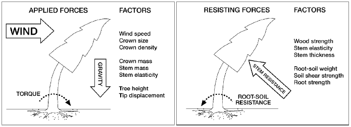

```{r setup, include = FALSE}
knitr::opts_chunk$set(
  collapse = TRUE,
  comment = "#>"
)
```
For a thorough scientific description of the model, please refer to Hale et al. (2015) and Hale et al. (2012). The material presented in these vignettes is meant to provide the reader with: a general introduction to the field of forest wind damage risk modelling; the use, limitations, and development of the *fgr* package. Additionally, some clarifications are presented of the approach used in ForestGALES to deal with complex issues such as: the maximum bending moment on forest trees caused by wind gusts; the combined effects of upwind gaps, distance of a tree from the upwind edge, and spacing on the bending moment; and the effect of stem, canopy, and snow weight when applicable on the total bending moment experienced by trees in the wind.

ForestGALES (Hale et al., 2015) is a mostly mechanistic, process-based mathematical model to calculate the risk of wind damage to forested stands.
It was originally developed for predicting wind damage in the interior of unthinned or lightly thinned commercial conifer stands in Great Britain (Gardiner et al., 2000).

The model has since found favour in the scientific community and in forest management applications. It has been been parameterised for the most common British conifer species (Gardiner et al., 2008), as well as for some conifer species in Canada, Denmark, France, Japan, and New Zealand (Byrne, 2005; Cucchi et al., 2005; Kamimura et al., 2008; Mikkelsen, 2007; Moore and Somerville, 1998; Ruel et al., 2000), and recently for *Eucalyptus globulus* in Spain (Locatelli et al., 2016). Model parametrisation for other broadleaf species included in this package (i.e. Oak, Birch, and Beech) is still at the developmental stage and as such should be used with some caution.

Throughout the package documentation, we will use the name *ForestGALES* to refer to the model characteristics as described in e.g. Hale et al. (2015) or Gardiner et al. (2000, 2008). Conversely, when we refer to the functionalities implemented in this package, we use the name *fgr*.

## Wind damage to trees and forest stands
The mechanical forces acting on a tree during a windstorm are exerted by the wind itself and by gravity. Momentum transfer from the wind to a tree is applied by way of canopy resistance to the wind (Mayhead et al., 1975) and produces bending stresses in the stem (Milne, 1995) and in the roots (Coutts, 1986). The force of the wind ($F_{Wind}$, N) acting at any height z up a tree is calculated as follows (Peltola, 2006):
\begin{align}
F_{Wind} = \frac{1}{2} \cdot C_d \cdot \rho \cdot u(z)^2 \cdot A(z)
\end{align}
Where $C_d$ is the drag coefficient of the tree canopy (dimensionless), $\rho$ is the air density (kg m-3), $u(z)$ is the mean wind speed (m s-1) at height z, and A(z) is the streamlined projected area (m2) of the canopy and stem of the tree at height z. As a tree is swayed from its vertical axis under the action of the wind, an additional force ($F_{Tree}$, N) is provided by the gravitational force acting on the masses of the stem, canopy, and snow, when applicable (Peltola, 2006). This gravitational force can similarly be calculated at any height z:
\begin{align}
F_{Tree}(z) = M(z) \cdot g
\end{align}
Where M(z) is the mass (kg) of the tree components, and snow when applicable, and g is the gravitational constant (m s-2). Using Eq. 1 and 2 it is possible to calculate the total bending moment resulting from wind and gravitational forces, at any point along the stem:
\begin{align}
BM_{max}(z) = F_{Wind} \cdot z + F_{Tree} \cdot x(z)
\end{align}
Where z is the height along the tree (m) and x(z) is the horizontal displacement (m) of the tree under the wind loading. The horizontal displacement is assumed proportional and inversely proportional, respectively, to the force of the wind and the stiffness of the stem (Peltola and Kellomaki, 1993). The stiffness of the stem is defined as the product of the Modulus of Elasticity of stem wood by the second moment of area of the cross section of the stem (i.e. EI), calculated from the stem diameter (Wood, 1995). The stem and the root-soil plate provide resistance to breakage and overturning, respectively. These resistive moments are the result of stem stiffness, wood strength, weight of the root-soil plate, structural strength of the roots, and the soil shear strength. Figure 1, from Peltola (2006), provides a diagrammatical representation of these forces.



Tree resistance to breakage is based on the assumption that stress from wind loading in the outer fibres of the stem is constant along the height of the stem between the base of the canopy and the base of the tree (Morgan and Cannell, 1994). Following this, calculation of the stress can be performed at any height up the stem (e.g. at tree base, or at breast height, 1.3m). When the calculated stress exceeds the Modulus of Rupture of green wood, it is predicted that the tree stem will break (Peltola, 2006). It is known that the presence of wood knots can decrease stem strength (e.g. Lavers, 1969).

Tree anchorage can be impaired when trees are shallow-rooted, as in poorly drained soils which are not favourable to the development of sinker roots or taproots, which can provide the tree with additional anchorage (Peltola, 2006). This often happens when a hardpan layer is present in the soil at shallow depths, raising the water table (Danjon, 2005). Under such circumstances, and in the absence of further constraints, trees devote their resources on the radial and lateral development of roots to improve anchorage (Nicoll et al., 2006; Ray and Nicoll, 1998). Coutts (1986) reports that when mechanically uprooting shallow-rooted Sitka spruce trees (*Picea sitchensis* (Bong) Carr.) under static forces, the root system component that provided most of the anchorage at maximum load was the windward roots. At high latitudes, ground frost can improve tree stability during winter months (Peltola et al., 1999). 

## Introducing the *roughness* and the *TMC* methods
ForestGALES' calculations of stand vulnerability to wind damage, and the associated risk, are derived from tree dimensions and stand and site characteristics. 
By vulnerability, we mean the critical wind speeds (CWS) of damage. These are the wind speeds that would generate a critical turning moment on the tree that would result in tree damage, either in the form of stem breakage or tree uprooting. 

Within ForestGALES, two methods have been developed for these calculations (Hale et al., 2015). The original '*roughness*' method is designed to calculate the vulnerability of, and risk to a homogeneous forest stand. The 'turning moment coefficient' (*TMC*) method instead allows calculating the vulnerability of, and risk to individual trees within a stand. The *TMC* method therefore lends itself very well to the wind damage risk assessment of heterogeneous forest stands.

Regardless of the method employed, ForestGALES can be conceptually divided in 2 modules. The main one - GALES - calculates the CWS that are expected to result in wind damage by uprooting or stem breakage. The second  module calculates the probability of exceeding such wind speeds (Gardiner et al., 2008). The probability of exceeding the calculated CWS is derived from information on the wind climate of the area of interest. Typically, the shape and scale (A and k, respectively) parameters of a Weibull distribution of mean wind speed are used to describe the prevailing wind climate in a given location (Quine, 2000). The Weibull parameters can either be fitted to time series of local wind speed data, or calculated from an airflow model (e.g. WAsP, https://www.wasp.dk/ ). In Great Britain, the localised wind climate is normally described with DAMS scores (Detailed Aspects Method of Scoring). These describe the windiness of a site based on topographic characteristics, and are only available for Britain (Quine and White, 1994).
ForestGALES operates with Weibull parameters. For forests in the UK, when Weibull parameters are not available, ForestGALES uses a standard value of Weibull k (1.85) and it translates DAMS scores into Weibull A (Quine, 2000).

The *roughness* version of the model is based on the idea of momentum stress partitioning (Raupach, 1994) between trees to calculate the wind loading on the mean tree in the forest, and a Gust factor to convert from mean to extreme wind loading. Locatelli et al. (2017) submitted the *roughness* method to a Global Sensitivity Analysis (performed with a Copula extension of the method of Sobol' to allow covariance between variables, as expected for e.g. tree height and dbh) to identify the main drivers of variation in the model outputs. Their results show that, for the GALES module, tree height and dbh are the main drivers of variance, followed by spacing and gap size. The effect of species is marginal compared to these, as is that of soil type and rooting depth. With regards to the probabilities of damage, the wind climate is the most important variable.

The new *TMC* approach to calculating the CWS is based instead on direct linear relationships between tree size, the maximum turning moment, and the mean wind speed at canopy top, thus removing the need for a Gust factor. It can simulate the effect of stand thinnings on the wind loading on the retained trees, and allows the use of competition indices to model tree interactions. In the *fgr* R package, two competition indices identified by Hale et al. (2012) are available to the user. One is independent of the distance between trees, and rather based on the basal area of trees larger than the target tree (*Bal* in the package). The other (*Hegyi*) is a distance-dependent index developed by Hegyi (1974).
The *TMC* approach is designed for mixed species stands, and for structurally complex stands with multiple stories. It is still at the developmental stage, and it borrows some procedures from the *roughness* method, most notably the conversion of the calculated critical wind speeds at canopy top to the corresponding critical wind speeds at a height compatible with anemometer standards, required for the estimation of the probabilities of damage. For the calculations of the aerodynamic parameters (zero-plane displacement and canopy surface roughness) required in the `elevate` function, and for the gap and edge effects calculations, we have introduced the concept of *equivalent mean height*. This requirement is dictated by the fact that for *stand-level* calculations in structurally complex stands, all storeys need to be accounted for. However, using the arithmetic mean of the height of all trees in a multi-storey stand might put too much emphasis on small trees, which are less affected by wind stress because of the wind speed profile within the canopy (Gardiner, 2008). For now, we overcome this problem with the use of *equivalent mean height*, calculated from stand top height, and which essentially is akin to a weighed mean favouring tall trees. The rationale for this is that, at stand level, the bulk of wind-induced moment absortion from the canopy is performed by taller-than-average trees within a multi-storey stand.      

## *fgr* R Vignette documentation
The Vignette documentation in the *fgr* R package is structured around the various components of the *roughness* and *TMC* methods. Example datasets are available for both methods.

At the topmost level, the inputs and outputs are summarised in the `Wrapper Functions` documentation. The model is designed to encourage users to customise their simulations with as much information as it is available. At the same time, the model is equipped with default values and formulas, some of which are species-specific, to allow more conventional wind damage risk simulations. 
Essential, Desirable, and Advanced inputs are introduced in the `Wrapper Functions` vignette. Essential inputs include: tree species, tree height, dbh, and spacing. Without these, the CWS cannot be computed. Default values for Desirables, often species-specific, are provided in case these inputs are not known by the user. This corresponds to the most common use of ForestGALES for use in forest management against wind damage. The Advanced inputs allow extensive customisation in case specific values (e.g. of the mechanical properties of green wood) are known. Finally, if information on the localised wind climate is known, the calculated CWS can be translated into the probabilities of damage. Otherwise, the simulations return the CWS only.
With regards to the model outputs, users can choose between a short list of essential outputs (CWS and associated probabilities), or an extensive list of model outputs which include e.g. the critical moments, the aerodynamic and streamlining properties of the stand. 

Functions to calculate the volume of tree stem and canopy are provided in the package, and documented in the `Stem Volume` vignette. These functions are to an extent species-specific and based on published tree taper functions. Stem and canopy volume are part of the Advanced inputs and as such they can be customised if required. 

Similarly, the conversion between top and mean height, and the calculation of canopy dimensions (length and width) are performed with species-specific parameters, as described in the `Tree Dimensions` vignette. The resulting tree dimensions can be overridden by the user as they are either Essential or Desirable inputs.

The various components of the *roughness* and *TMC* methods are described in the remaining documentation. The calculations of the critical moments of stem breakage and tree overturning are described in the `Critical Resistive Moments` vignette. The data sources for the combination of soil type/rooting depth, and species-specific values of tree anchorage are reported in this vignette. Similarly, the soil classification used in ForestGALES is presented there.

The `Streamlining and Drag` vignette documents the approach used to model the aerodynamic and streamlining properties of the modelled stand, as calculated with *fgr* from the work of Thom (1971), Mayhead et al. (1975), and Raupach (1992, 1994). The drag over the canopy is discussed, with the description of the calculation of $u_*$ (the friction velocity), $z_0$ (canopy roughness), $d$ (the zero-plane displacement) and $\gamma$ (i.e. the frontal area - per unit ground area - of the trees as roughness elements). The streamlining of the crown is also discussed.

The different approaches to calculating the citical moments in the *roughness* and the *TMC* methods are described separately. In the `Bending Moment Roughness` vignette, the theory of wind shear stress partitioning on the trees canopy is introduced, along with the effect of the Gust factor. Both the original formulas, published in the literature (e.g. Gardiner et al., 2000; Hale et al., 2015), and the modifications adopted in the *fgr* R package to improve model performance, are discussed.

The approach developed by Hale et al. (2012) to calculate the CWS of individual trees wihthin a stand is introduced in the `Turning coefficients functions` vignette. The relationship (termed $T_C$, the turning moment coefficient) between the Maximum applied turning moment at tree base and the mean wind speed at the top of the canopy is discussed, as is the relationship between $T_C$ and tree size. The use of the *Bal* and the *Hegyi* competition indices in the calculations of $T_C$ is discussed, as is the modelling of thinnings using the *TMC_Ratio* of tree spacing before and after thinning.

In the current release of *fgr*, the additional moment provided by the weight of the stem, canopy, and snow (when present) is accounted for with the *Deflection Loading Factor* (DLF), which has been derived from the work of Gardiner (1989, 1992). The `Deflection Loading Factor` vignette introduces the concepts used for the calculation of DLF.

The `Edge Gap and Gust effects` vignette discusses the approach taken in ForestGALES to model the effect of upwind gaps and stand edges on the maximum and mean wind loading on trees at varying distance from an upwind edge, which has been the topic of much research (e.g. Stacey et al., 1994; Gardiner et al., 1997). Because of the complex airflow conditions over forest canopies, and especially near upwind stand edges, calculating the critical applied turning moment ($M_{appl\_max}$, and consequently the corresponding CWS) near the stand edge is problematic. Adopting the experimental approach of Stacey et al. (1994) and Gardiner et al. (1997) in ForestGALES, $M_{appl\_max}$ for a tree at the edge (or close to the edge, i.e. at a distance less that 9 times mean stand tree height) can be calculated firstly *as if the tree were in the middle of the stand*, and subsequently translated to what the tree's $M_{appl\_max}$ would correspond to if the same tree were closer to the upwind edge, using the mathematical formulas detailed in Gardiner et al. (2000). This approach can be adopted for individual trees (as in the *TMC* method) or for the mean tree (as in the *roughness* method). The rationale of using a Gust factor in the *roughness* method to convert the mean to maximum applied turning moment (Gardiner et al., 1997; Gardiner et al., 2000; Peltola et al., 1999) is also presented in the `Edge Gap and Gust effects` vignette.

Finally, the `Critical Wind Speeds` vignette summarises the calculations to derive the CWS for breakage and overturning from the corresponding critical turning moments, for both the *roughness* and the *TMC* methods. The differences between the CWS formulas in the *roughness* method adopted in the package and the equations published in e.g. Hale et al. (2015) are illustrated. Similarly, the formulas used for the calculation of the CWS in the *TMC* method differ from those in Hale et al. (2015) as the additional turning moment in *fgr* is calculated with the DLF rather than using the constant value of 1.136 derived from experimental tree and stand data. Calculating DLF, rather than using a constant value, allows modelling the presence of snow on the tree canopy. Finally, the formulas for elevating the CWS computed at canopy top to anemometer's height (i.e. 10m above $d$) to compare the CWS with anemometer's and airflow models data, and the equations to calculate the risk of damage associated with the elevated CWS and the localised wind climate, are detailed in the `Critical Wind Speeds` vignette. 


## Bibliography
- Byrne, K.E. 2005. Critical turning moments and drag equations for British Columbia conifers. M.Sc. thesis, University of British Columbia.
- Coutts, M.P. 1986. Components of tree stability in Sitka Spruce on peaty gley soil. Forestry, 59, 173-197.
- Cucchi, V., Meredieu, C., Stokes, A., De Coligny, F., Suarez, J., Gardiner, B.A. 2005. Modelling the windthrow risk for simulated forest stands of Maritime pine (Pinus pinaster Ait.). Forest Ecology and Management, 213, 184-196.
- Danjon, F., Fourcaud, T., Bert, D. 2005. Root architecture and wind-firmness of mature Pinus pinaster. New Phytologist, 168, 387-400.
- Gardiner, B.A. 2008. Calculation of the impact of forest clearings on wind speeds. Forest Research Internal Note. Roslin, UK.
- Gardiner, B.A., Stacey, G.R., Belcher, R.E., Wood, C.J. 1997. Field and wind tunnel assessments of the implications of respacing and thinning for tree stability. Forestry, 70, 233-252.
- Gardiner, B.A., Peltola, H.M., Kellomaki, S. 2000. Comparison of two models for predicting the critical wind speeds required to damage coniferous trees. Ecological Modelling, 129, 1-23.
- Hale SE, Gardiner BA, Wellpott A, Nicoll BC and Achim A, 2012. Wind loading of trees: influence of tree size and competition. Eur J For Res 131, 203-217. doi 10.1007/s10342-010-0448-2
- Hale, S.A., Gardiner, B.A., Peace, A., Nicoll, B., Taylor, P., Pizzirani, S. 2015. Comparison and validation of three versions of a forest wind risk model. Environmental Modelling & Software, 68, 27-41.
- Hegyi F (1974) A simulation model for managing jack pine stands. In: Fries J (ed) Growth models for tree and stand simulation. Royal College of Forestry, Stockholm, pp 74–90
- Kamimura, K., Gardiner, B.A., Kato, A., Hiroshima, T., Shiraishi, N. 2008. Developing a decision support approach to reduce wind damage risk - a case study on sugi (*Cryptomeria japonica* (L.f.) D.Don) forests in Japan. Forestry, 81, 429-445.
- Lavers, G. 1969. The strength properties of timbers. Forest Products Research Laboratory Bulletin. London: HMSO.
- Locatelli, T., Gardiner, B.A., Tarantola, S., Nicoll, B., Bonnefond, J.-M., Garrigou, D., Kamimura, K., Patenaude, G. 2016. Modelling wind risk to Eucalyptus globulus (Labill.) stands. Forest Ecology and Management, 365, 159-173.
- Locatelli, T., Tarantola, S., Gardiner, B. and Patenaude, G., 2017. Variance-based sensitivity analysis of a wind risk model-Model behaviour and lessons for forest modelling. Environmental Modelling & Software, 87, pp.84-109.
- Mayhead, G.J., Gardiner, J.B.H., Durrant, D.W., 1975. Physical properties of conifers in relation to plantation stability. Forestry Commission, Edinburgh. Unpublished report.
- Mikkelsen, S.K. 2007. "Stormfald": A further developed version of ForestGALES tested under Danish conditions. University of Copenhagen, Faculty of Life Sciences, Department of Forest and Landscape. 
- Milne, R. 1995. Modelling mechanical stresses in living Sitka spruce stems. Wind and Trees. Cambridge University Press, Cambridge, 165-181.
- Moore, J. and Somerville, A. 1998. Assessing the risk of wind damage to plantation forests in New Zealand. New Zealand Forestry, 43, 25-29.
- Morgan, J. and Cannell, M.G.R. 1994. Shape of tree stems - a re-examination of the uniform stress hypothesis. Tree physiology, 14, 49-62.
- Nicoll, B.C., Gardiner, B.A., Rayner, B., Peace, A.J. 2006. Anchorage of coniferous trees in relation to species, soil type, and rooting depth. Canadian Journal of Forest Research-Revue Canadienne De Recherche Forestiere, 36, 1871-1883.
- Peltola, H.M., Kellomaki, S., Vaisanen, H., Ikonen, V.P. 1999. A mechanistic model for assessing the risk of wind and snow damage to single trees and stands of Scots pine, Norway spruce, and birch. Canadian Journal of Forest Research-Revue Canadienne De Recherche Forestiere, 29, 647-661.
- Peltola, H.M. 2006. Mechanical stability of trees under static loads. American Journal of Botany, 93, 1501-1511.
- Quine, C.P. and White, I.M.S. 1994. Using the relationship between rate of tatter and topographic variables to predict site windiness in upland Britain. Forestry, 67, 245-256.
- Quine, C.P. 2000. Estimation of mean wind climate and probability of strong winds for wind risk assessment. Forestry, 73, 247-258.
- Raupach, M.R., 1992. Drag and drag partition on rough surfaces. Boundary Layer Meteorol. 60, 375–395.
- Raupach, M.R. 1994 Simplified Expressions for vegetation roughness and zero-plane displacement as functions of canopy height and area index.Boundary-Layer Meteorology, 71, 211-216.
- Ray, D. and Nicoll, B.C. 1998. The effect of soil water-table depth on root-plate development and stability of Sitka spruce. Forestry, 71, 169-182.
- Ruel, J.C., Quine, C.P., Meunier, S., Suarez, J. 2000. Estimating windthrow risk in balsam fir stands with the ForestGALES model. Forestry Chronicle, 76, 329-337.
- Stacey, G.R., Belcher, R.E., Wood, C.J., Gardiner, B.A. 1994. Wind flows and forces in a model spruce forest. Boundary-Layer Meteorology, 69, 311-334.
- Thom, A.S., 1971. Momentum absorption by vegetation. Q. J. R. Meteorol. Soc. 97, 414–428.
